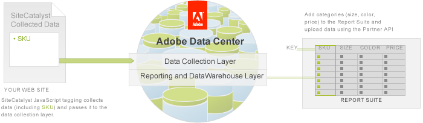
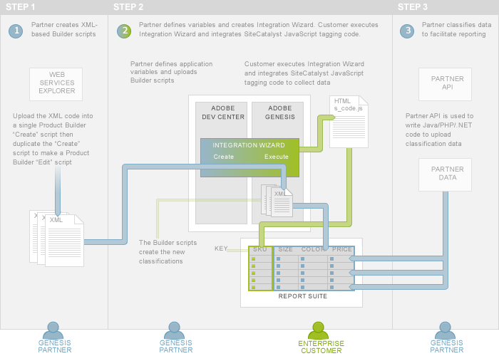

# 5. Classify Partner Data Tutorial

 

In the first four tutorials of the series, partners learned how to package On Demand scripts for reporting with product variables to create the Integration Wizard. Customers learned how to activate the product integration. Partners also learned how to run reports that included data from both their own and Customer data collections.

In this fifth article of the series, you will learn how to create a second type of XML-based script, Product Builder scripts. Specifically, you will learn how to create a Product Builder script to create classification categories in a Customer's report suite and then package the script in the Integration Wizard. You will also learn how to upload classified data programmatically to the new categories in the report suite using the Partner API.

**Note:** You use On Demand scripts to generate reports and Product Builder scripts to automate the configuration of Customer report suites before data handling operations.

## Prerequisite knowledge, system permissions and environment setup

-   This article is for PHP, Java or C\# developers with web and XML experience.
-   Partners must have a Developer Connection account to be able to create scripts. Follow the directions in the Setup your environment and authenticated access to the Partner API article.

## Download code files for this tutorial

This article displays code inline to the discussion but you can also download the code for PHP, Java or C\# to explore on your own.

-   [Partner\_API\_classify\_PHP.zip](http://microsite.omniture.com/t2/api-xml/en_US/get_started/zips/Partner_API_classify_PHP.zip) 
-   [Partner\_API\_classify\_Java.zip](http://microsite.omniture.com/t2/api-xml/en_US/get_started/zips/Partner_API_classify_Java.zip) 
-   [Partner\_API\_classify\_C\#.zip](http://microsite.omniture.com/t2/api-xml/en_US/get_started/zips/Partner_API_classify_C_sharp.zip) 

Follow the directions in the [Authentication and Setup Tutorial](c_Authentication_and_Setup.md#) 

## An overview of classifying data using the Partner API

The data that Analytics Customers collect in their reporting suite may include one or more fields that can be used as a unique, identifying column, called a *key*, for a category of data. For example, you might track the SKU number for a product as a key in your e-commerce store.

Developers can create new columns in the report suite and import data related to a key using a process called *classification*. For a product SKU number, this may include details like the product name, color, size or brand \(see Figure 2\).

Classification involves two steps:

1.   **The creation of the additional columns, or classifications,** in the report suite using Product Builder scripts.
2.   **The import of data** into the new classifications using the Partner API and code that you write in Java, PHP or .NET.

You will learn how to perform both of these steps in the remainder of this article.

## An overview of creating classifications in the report suite

You use Product Builder scripts to create the new columns, or classifications, in your Analytics report suite based on a unique key. Once the classifications are created, you can later upload data to them using the Partner API.

There are two types of Product Builder scripts, *create* and *edit*. You will create them using the Adobe API Explorer, which is a web interface that allows you to select web services methods and see the associated request and response structures. You will use the create script to initially create the classifications in your report suite. You will use the edit script when you need to update the classifications.

**Note:** In the **Create On Demand scripts to generate reports** tutorial, you used Report Builder and Adobe API Explorer to generate On Demand scripts. However, Report Builder cannot access the Adobe Admin API, which is required to create classifications. Therefore, you will only use the Adobe API Explorer for this article.

The Product Builder Create and Edit scripts automate processes that you want to initialize during product integration. Therefore, you will package them in the Integration Wizard that the Customer will execute.

## An overview of importing classification data into the report suite

As you learned in earlier tutorials and articles of this series, a Customer will execute the Integration Wizard. Since the Product Builder scripts are part of the wizard, they will run, which will create the new classifications in the Customer's report suite.

Now you, as the Partner, can upload new data into the classification by writing Java, PHP or .NET code that accesses the Partner API \(Step 3\).

-   **[Step 1: Create a Product Builder Script to classify Data](c_Create_a_Product_Builder_Script_to_classify_Data.md)**  
 
-   **[Step 2: Create an Edit Product Builder Script](c_Create_an_Edit_Product_Builder_Script.md)**  
 
-   **[Step 3: Upload the Classification Product Builder Script to the Integration Wizard](c_Upload_the_Classification_Product_Builder_Script_to_the_Integration_Wizard.md)**  
 
-   **[Step 4: Customer Execution of the Integration Wizard](c_Customer_Execution_Classifications.md)**  
 
-   **[Step 5: Upload Classification Data using the Partner API](c_Upload_Classification_Data_using_the_Partner_API.md)**  
 
-   **[Step 6: Check the Classified Data in the Analytics UI](c_Check_the_Classified_Data_in_the_Analytics_UI.md)**  
 

