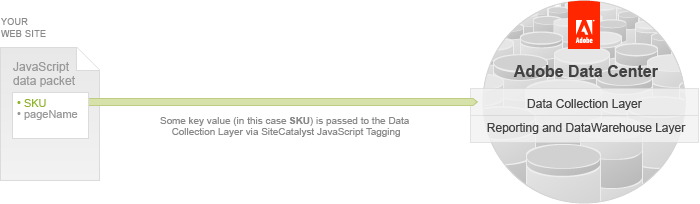

# Classifying Data using SAINT

The primary way to collect a visitor’s online analytics data as they browse your web site is through Analytics JavaScript Tagging.

In this method, you add Analytics JavaScript code to your web pages. When a user views the page, the data that you have tagged for collection is sent to the Adobe Data Collection layer.

Analytics tracks many common elements in a web site like page views, visitors, products and more. Each of these elements may have many properties associated with them, but usually also have one unique identifying value called a key. The product SKU number is the key value collected by Analytics for the product the visitor viewed.

All the variables tagged in JavaScript for Analytics collection are passed in a query string, which inherently limits the amount of data you want to collect. This means that you likely won’t collect additional information like product color, product name, etc, but will, instead, upload this data from external resources, thus making it available within reports.

There are two options to import/export data and associate, or classify, them with the key value using SAINT:

-   [Using the SAINT Classifications UI](c_Using_the_SAINT_Classifications_UI.md#) 
-   [Using the SAINT Classifications API](c_Using_the_SAINT_Classifications_API.md#) 

**Parent topic:** [SAINT API Tutorial](c_SAINT_API_Overview.md)

