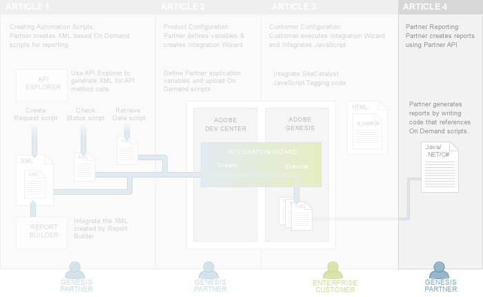

# 4. Partner Reports Tutorial

 

In the first tutorial of the series, [Create On Demand scripts to generate reports](c_scripting.md#), you learned how to create On Demand scripts, which are necessary to create Partner reports. Then in the second tutorial of this series, [Configure the Partner application for Data Connectors integration](c_Partner_Application_Configuration_for_Data_Connectors_Tutorial.md#), you learned how to package all of the scripts and variables in the Integration Wizard that Customers use during integration.

The third tutorial of this series, [Integrate Partner data into Customer application](c_Integrate_Data_Connectors_Partner_Data_into_Customer_Application.md#), shows Customers how to activate an integration that requests data from a product and sends it, using Analytics, to the Adobe Experience Cloud collection servers.

Once a product integration is activated by a Customer, then you, the Partner, can generate a report on the integrated data using the On Demand scripts and the Data Connectors Partner API. You will learn how to generate a report in this fourth tutorial of the series.

##  **Prerequisite knowledge, system permissions and environment setup** 

This article is for PHP, Java or C\# developers with web and XML experience who have completed the first three tutorials in this series, listed in the table above.

## Download code files for this tutorial

This article displays code inline to the discussion but you can also download the code for PHP, Java or C\# to explore on your own.

-    [Partner\_API\_reporting\_PHP.zip](http://microsite.omniture.com/t2/api-xml/en_US/get_started/zips/Partner_API_reporting_PHP.zip) 
-    [Partner\_API\_reporting\_Java.zip](http://microsite.omniture.com/t2/api-xml/en_US/get_started/zips/Partner_API_reporting_Java.zip) 
-    [Partner\_API\_reporting\_C\#.zip](http://microsite.omniture.com/t2/api-xml/en_US/get_started/zips/Partner_API_reporting_C_sharp.zip) 

Follow the directions in the [Authentication and Setup Tutorial](c_Authentication_and_Setup.md#) and then unzip these files to your project folder

## An overview of reporting using the Partner API

Partners do not have access to a user interface that allows you to run reports. You must create reports programmatically using the Data Connectors Partner API. Before you can run reports that integrate Customer data, the Customer must first integrate with your product, which requires that they run the Integration Wizard. This, of course, means that you, as the Partner, must have created the Integration Wizard with its associated scripts and variable assignments. To create reports, you will write custom code against the Partner API to execute the On Demand scripts that you created for the Integration Wizard.

-   **[Step 1: Retrieve Available Integrations for the Data Connectors Partner](c_Retrieve_all_the_available_integrations_for_the_Data_Connectors_Partner.md)**  
 
-   **[Step 2: Execute the On Demand Scripts using the Partner.RunScript API Call](c_Execute_the_On_Demand_scripts.md)**  
 
-   **[Step 3: Print the Report Data on the Console](c_Print_the_Report_Data_on_the_Console.md)**  
 

