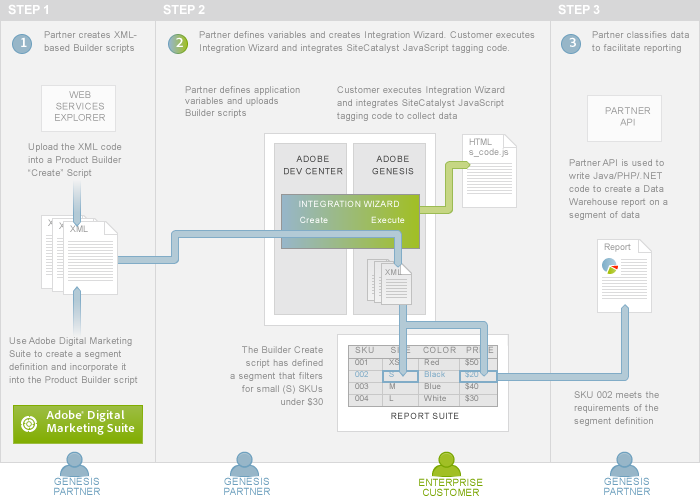
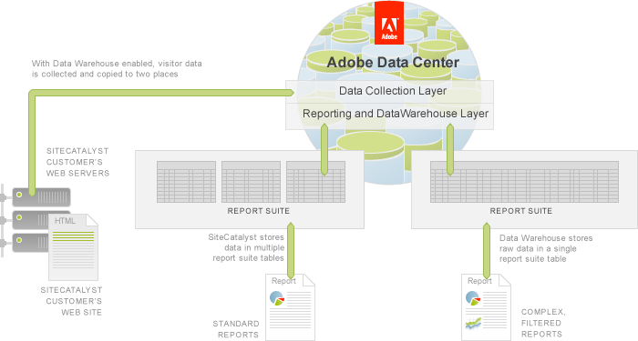
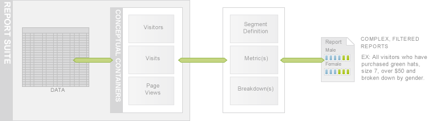

# 7. Data Warehouse Tutorial

 

Before you, as a Partner, can create a Data Warehouse report, you first need to create a segment definition using the Adobe Experience Cloud and then integrate it into a Product Builder script \(see Step 1 in the following figure\).

There are two types of Product Builder scripts, *create* and *edit*. Some tasks require both, but creating a Data Warehouse report only requires the create script. You create Product Builder scripts using the Adobe API Explorer, which is a web interface that allows you to select web services methods and see the associated request and response structures.

**Note:** In the **Create On Demand scripts to generate reports** tutorial, you used Report Builder and API Explorer to generate On Demand scripts. However, Report Builder cannot access the Adobe Admin API, which is required to create a Data Warehouse report. Therefore, you will only use the API Explorer for this article.

Product Builder scripts automate processes that you want to initialize during product integration. Therefore, you will package them in the Integration Wizard that the Customer will execute.

As you learned in earlier tutorials and articles of this series, a Customer will execute the Integration Wizard. Since the Product Builder script is part of the wizard, it will run, which will create the new segment definition \(see Step 2 of Figure 6\).

Now you, as the Partner, can run the Data Warehouse report by writing Java, PHP or .NET code that accesses the Partner API.

For the demo application, you are creating a segment definition which will return all the records where a Twitter handle is present. You can create the segment definition programmatically, but it is easier to create one using the Adobe Experience Cloud's Analytics UI, which will be the focus of this article.

## Prerequisite knowledge, system permissions and environment setup

-   This article is for PHP, Java or C\# developers with web and XML experience.
-   Partners must have a Developer Connection account to be able to create scripts. Follow the directions in the Setup your environment and authenticated access to the Partner API.

## Download code files for this tutorial

This article displays code inline to the discussion but you can also download the code for PHP, Java or C\# to explore on your own.

-   [Partner\_API\_datawarehouse\_PHP.zip](http://microsite.omniture.com/t2/api-xml/en_US/get_started/zips/Partner_API_datawarehouse_PHP.zip) 
-   [Partner\_API\_datawarehouse\_Java.zip](http://microsite.omniture.com/t2/api-xml/en_US/get_started/zips/Partner_API_datawarehouse_Java.zip) 
-   [Partner\_API\_datawarehouse\_C\#.zip](http://microsite.omniture.com/t2/api-xml/en_US/get_started/zips/Partner_API_datawarehouse_C_sharp.zip) 

Follow the directions in the [Authentication and Setup Tutorial](c_Authentication_and_Setup.md#) and then unzip these files to your project folder.

## An overview of Data Warehouse

In a typical Analytics implementation, the Analytics JavaScript tagging code that a Analytics Customer embeds in each page of his web site passes a visitor's online analytics data to the Data Collection Layer in the Adobe Data Center. This data is stored in one or more report suite tables in the Customer's account. From there, Customer can run standard reports. If a Customer has Data Warehouse enabled, then their data is copied to a second location. From there, he can run Data Warehouse report.

With Data Warehouse enabled, the same raw, unprocessed Analytics analytics data is copied into a single table allowing for more robust reporting options.

**Note:** Data Warehouse is only enabled for administrator-level users by default. An administrator must enable Data Warehouse access for other users and for each report suite. Partners can access Data Warehouse data from the Adobe Experience Cloud or through the Partner API.

**Note:** Due to the complexity of Data Warehouse reports, they are not immediately available, can take up to 72 hours to generate, and are accessible via email, FTP or API delivery mechanisms.

## An overview of segment definitions

The Data Warehouse stores raw data in a single table but allows you to access the data in three conceptual containers: Visitors, Visits and Page Views and include or exclude data in your reports using *segment rules* or *segment definitions*. A typical segment definition comprises a conceptual container and a rule that filters the data in that container.

In this article, you will learn how to create the segment definition using a Product Builder script and then run it using the Partner API.

## An overview of metrics

You can add data points to your report using a *metric list*. A metric is a number that represents a count or a ratio for something you want to measure. Examples of metrics are: revenue of a product, number of visits and number of page views.

You can define multiple metrics while creating a segment and they are represented as additional data columns in your report.

## An overview of breakdowns

You can further refine reports by using *breakdowns*, also known as *dimensions*, which are a way to group data, for instance by age, gender, browser height, campaigns, days since last visit, etc. The following figure shows a report breakdown by gender.

Data Warehouse provides predefined breakdown variables or you can define your own variables from custom eVars or props variables.

-   **[Step 1: Creating a Segment](c_Creating_a_Segment_Definition.md)**  
 
-   **[Step 2: Create a Product Builder Script to Define a Data Warehouse Segment](c_Create_a_Product_Builder_Script_to_Define_a_Data_Warehouse_Segment.md)**  
 
-   **[Step 3: Upload the Data Warehouse Product Builder Script to the Integration Wizard](c_Upload_the_Data_Warehouse_Product_Builder_Script_to_the_Integration_Wizard.md)**  
 
-   **[Step 4: Customer Execution of the Integration Wizard](c_Customer_Execution_of_the_Integration_Wizard.md)**  
 
-   **[Step 5: Create a Request for Segmented Data using the Partner API](c_Create_a_Request_for_Segmented_Data_using_the_Partner_API.md)**  
 
-   **[Step 6: Print the Data Warehouse Report on the Console](c_Print_the_Data_Warehouse_Report_on_the_Console.md)**  
 

