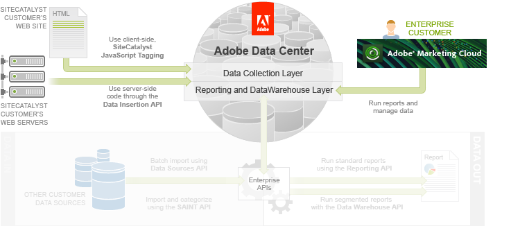

# Data Insertion API Tutorial

 

There are two ways to pass a web site visitor’s online analytics data to the Adobe Data Collection Layer:

-   Embed client-side Analytics JavaScript Tagging code in the web pages
-   Use the Data Insertion API and server-side code

In this article, you will learn about the difference between these two methods and how to use the Data Insertion API.

## Prerequisite knowledge, system permissions and environment setup

This article is for PHP, Java or C\# developers with knowledge of HTML, XML, and JavaScript.

Unlike the other APIs, the Data Insertion API does not require authentication, use SOAP or use API Tokens. However, you will need the report suite ID that you created in the Setup and Security tutorial.

This article assumes you have the equivalent knowledge of Analytics JavaScript Tagging as discussed in [Analytics Tagging](https://marketing.adobe.com/resources/help/en_US/sc/implement/js_implementation.html).

-   **[Data Collection](c_Data_Collection_Overview.md)**  
 
-   **[Demo Application](c_Demo_Application_Data_Insertion.md)**  
 
-   **[Submitting Data to the Server Using HTTP](c_Submitting_Data_to_the_Server_Using_HTTP.md)**  
 
-   **[Step 1: Define the XML Data Format for HTTP POST](c_Define_the_XML_Data_Format_for_HTTP_POST.md)**  
 
-   **[Step 2: Assign Page-Specific Variables](c_Assign_Page-Specific_Variables.md)**  
 
-   **[Step 3: Send Page-Specific Data to Analytics](c_Send_Page-Specific_Data_to_Analytics.md)**  
 
-   **[Step 4: Send Event-Specific Data to Analytics](c_Send_Event-Specific_Data_to_Analytics.md)**  
 
-   **[Step 5: Verify Data Collection in Analytics](c_Verify_Data_Collection_in_Analytics-data-insertion.md)**  
In this section you learn how to run reports in the Analytics UI to confirm that the data was collected.

