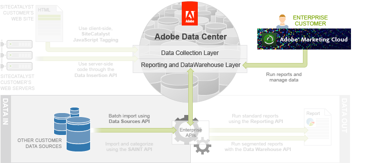

# Data Sources API Tutorial

 

The usual focus for Analytics data collection is on client-side JavaScript tagging, which submits a web site visitor’s online analytics data directly from each web page they access to the Adobe Data Collection Layer.

However, if you have additional data from external sources that you want to add to your Adobe Experience Cloud, you can also upload them in batches directly into the Data Collection Layer using two mechanisms:

-   The Data Sources Manager and FTP
-   The Data Sources API

These options are useful for uploading historical data or any data that you might want to add to enhance your reports.

In this article, you will get a brief overview of the mechanism that uses FTP and then focus on the Data Sources API for the remainder of the article. The following figure illustrates this API’s role relative to the others in the Enterprise API.

## Prerequisite knowledge, system permissions and environment setup

This article is for PHP, Java or C\# developers with web experience.

Analytics customers must be authenticated to use the Data Sources API. Follow the directions in the [Authentication and Setup Tutorial](c_Authentication_and_Setup.md#).

-   **[Importing Batch Data](c_Importing_Batch_Data.md)**  
 
-   **[Demo Application](c_Demo_Application_Overview-data-sources.md)**  
All of the articles and tutorials in this series are based on Adobe’s JJ. Esquire demo application \(www.jjesquire.com\).
-   **[Step 1: Create the Data Source](c_Create_the_Data_Source.md)**  
 
-   **[Step 2: Add Data to the Data Source](c_Add_Data_to_the_Data_Source.md)**  
 
-   **[Step 3: Monitor the Processing Queue and Upload Status](c_Monitor_the_Processing_Queue_and_Upload_Status.md)**  
 
-   **[Common Data Sources Methods](c_Data_Sources_Methods.md)**  
In this section, you will learn of a few useful Data Sources API methods.

