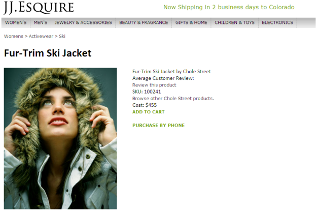

# Demo Application

 

All of the articles and tutorials in this series are based on Adobe’s JJ. Esquire demo application \(www.jjesquire.com\). An earlier article of this series, “Collect visitor analytics using Analytics JavaScript Tagging,” walks you through the steps of adding Analytics JavaScript Tagging code to four pages in the simplified JJ. Esquire demo application. The tagging code sends analytics data for each of the pages in the application to the Adobe Data Collection Layer, where it gets placed in the report suite for Data Warehouse.

In this article, you will create a segment rule in the Segment Definition Builder that reports how many first-time site visitors clicked the Purchase by Phone link in the product detail page.

 

Next you will define the report criteria like contact information \(name and phone number of the requester of the report\), report name and description, the name of the file to be delivered, the time frame to be considered for the report and the time granularity \(the unit of time to break down the report, such as hour, day, week\).

Lastly, you will learn two ways to execute the report: using the Data Warehouse UI in the Adobe Experience Cloud and using the Data Warehouse API.

**Parent topic:** [Data Warehouse API Tutorial](c_data_warehouse_API_tutorial.md)

