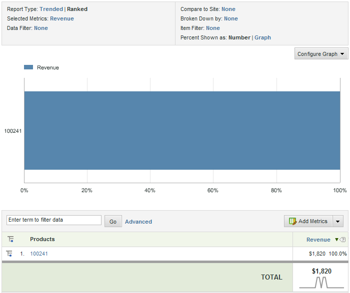

# Demo Application Overview

 

All of the articles and tutorials in this series are based on Adobe’s JJ. Esquire demo application \(www.jjesquire.com\). An earlier article of this series, Analytics JavaScript Tagging Tutorial, walks you through the steps of adding Analytics JavaScript Tagging code to four pages in the simplified JJ. Esquire demo application.

As visitors browse the product detail pages of the web site, the Analytics JavaScript tagging code submits the product SKU numbers to the Adobe Data Collection layer.

The other details about the product, like product name and cost are not passed to the server as online analytics data. Therefore, product reports only contain the SKU number.

In the JJ. Esquire demo application for this article, you will learn how to import and associate, or classify, the brand and category data for women’s ski jackets with the proper product in Analytics using the key, which, in this case, is SKU.

**Parent topic:** [SAINT API Tutorial](c_SAINT_API_Overview.md)

