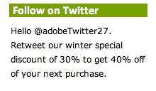

# Step 4: Display Product Data in the JJ. Esquire Demo Application

 

In the last section you learned that each page of the JJ. Esquire demo application is viewed, it calls the JavaScript library file \(**s\_code.js**\) with the data connectors JavaScript code. This code retrieves the Partner data which can be used in the Customer application.

Now, you will take the Twitter handle from the data connectors product data and display it on the JJ. Esquire Product List page.

1.  Return to the **s\_code.js** file.
2.  Before the Integrate module **setVars\(\)** method, define a new variable named **s\_author** and assign a value of " ". This variable will be used to display the Twitter handle on the JJ. Esquire demo application Product List page.
3.  At the end of the code In the Integrate module **setVars\(\)** function, assign the **s\_author** variable a value of **p.twitter\_handle**. You are assigning the **s\_author** variable to the Twitter handle retrieved from the data connectors product data.

```
s_author variable
 
s.loadModule("Integrate");
s.Integrate.add("JJEsquireTwitterPod");
var s_author = " ";
s.Integrate.JJEsquireTwitterPod.setVars=function(s,p)
{
      eval(getTwitterData());
      p.twitter_handle = s_1_Integrate_twitterexample_get_0.author_handle;
      p.twitter_followers = s_1_Integrate_twitterexample_get_0.followers;  
s.eVar3 = p.twitter_handle;
      s.events = "event3";
s.products = ";follower_count;;;event3=" + p.twitter_followers;
s_author = p.twitter_handle;
}
```

1.  Open the **list.html** file and locate the comment which states, "**Add the JavaScript code to display the s\_author variable here**".
2.  Copy the JavaScript code below and paste it in the **list.html** file after the comment mentioned above.

```
JavaScript code to display the s_author variable
 
<script language="JavaScript" type="text/javascript"><!--
      document.write(s_author);
 //--></script>.
```

This will display the Twitter handle in the **Follow on Twitter** pod on the Product List page of the JJ. Esquire demo application.



In the next section, you will step through the demo application which will retrieve data connectors product data, display the Twitter handle on the Product List web page, and pass the Twitter handle and number of Twitter followers to the Adobe Data Collection Layer**.** 

**Parent topic:** [3. Integrate Partner Data Tutorial](c_Integrate_Data_Connectors_Partner_Data_into_Customer_Application.md)

