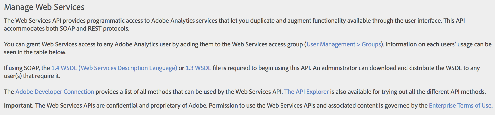

# Step 3: Download the Experience Cloud WSDL

 

In this section, you will download the Adobe Experience Cloud WSDL and save it to your computer. You will use it in the next sections of this setup guide.

1.  In the Adobe Marketing Cloud, navigate to **Analytics** \> **Admin****Company Settings** \> **Company**.

    

2.  Select **Web Services**.
3.  Click the **Web Services Description Language \(WSDL\)** link, in the introductory text. The link is in the text of the paragraph.

    

4.  Save the adobe\_analytics\_service-1.4.wsdl file to your computer. What you have just downloaded is the latest version of the WSDL file. You will use it to replace the WSDL provided in the solution files discussed in the next steps of this tutorial.

**Parent topic:** [Authentication and Setup Tutorial](c_Authentication_and_Setup.md)

