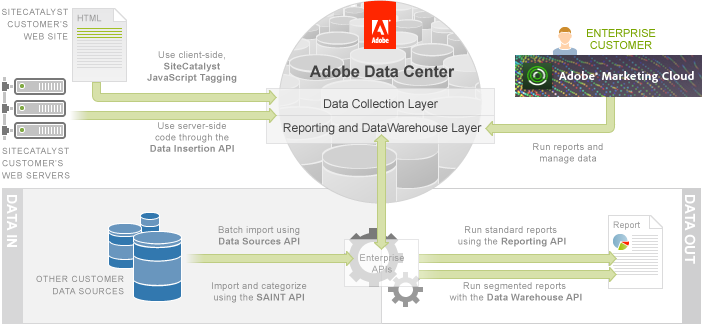

# Enterprise API Overview

 

## Introduction

The Enterprise API provides Customers with programmatic access to collect, import, export and run reports on their data. The following diagram shows the relationships between the various parts of the Enterprise API:

Using the Enterprise API, you can add data to the Adobe Experience Cloud \(Data In\) and run reports on this data \(Data Out\).

## Data In

-   [Analytics Tagging](https://marketing.adobe.com/resources/help/en_US/sc/implement/) - Client-side JavaScript tagging is the primary way that your web site collects visitor data using Analytics.
-   [Data Insertion API Tutorial](c_Data_Insertion_Overview.md#) - Most web sites use client-side JavaScript tagging to submit data to Analytics. In this article you learn an alternate way to collect data using server-side data submission via the Data Insertion API.
-   [Data Sources API Tutorial](c_Data_Sources_Overview.md#) - Visitor interaction with your web site is not the only way to collect data in the Adobe Experience Cloud. In this article, you learn how to upload batches of data directly from external resources using the Data Sources API.
-   [SAINT API Tutorial](c_SAINT_API_Overview.md#) - Sometimes you need additional data to enhance the readability and usefulness of a report. In this article, learn how to use the SAINT API to import data and associate it with existing report data.

## Data Out

-   [Reporting API Tutorial](c_Reporting_API_Tutorial.md#) - There are both visual and programmatic ways to create reports in Analytics. In this article, you learn how to use the Analytics UI and the Reporting API to create reports. You also learn about the Report Builder and Web Services Explorer tools.
-   [Data Warehouse API Tutorial](c_data_warehouse_API_tutorial.md#) - There are thousands of standard Analytics reports, but they cannot always provide you answers to your more complex questions. In this article, you learn about Data Warehouse and how to create segment definitions to generate advanced reports.

