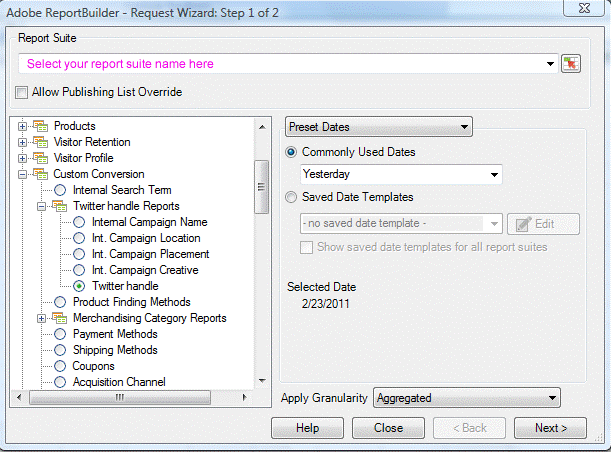

# Step 2: Generate XML using Report Builder

 

In this section, you will use Report Builder to generate the implementation-specific XML code for creating the report about Twitter data.

1.  Open Excel and locate the Report Builder Add-Ins tab.
2.  Select **Create**.
3.  In the wizard, select **JJEsquire Getting Started Suite** as your report suite from the drop down.

    **Note:** You created the report suite in the **Setup your environment and authenticated access to the Partner API** article.

4.  Select **Custom Conversion** \> **Twitter handle Reports** \> **Twitter handle** and click **Next**.

    

5.  Make sure the Metrics tab is selected and select **Twitter followers** as your metric.

    

6.  Select **Finish** to generate the report.
7.  Locate and open the **Report Builder-out.log** file, usually under your **My Documents** directory. There will be several calls in this log that Report Builder made to help you create the request \(such as ReportSuiteGetSettings, ReportGetReport, etc\).
8.  Search through the file to find the call that queued the report, which is ReportQueueRanked for this request.

    ReportQueueRanked is a method to request a report for one or more elements and one or more metrics. To learn more about elements and metrics, see the **Analytics reporting documentation**.

    **Note:** Report Builder names the method ReportQueueRanked, but it is actually Report.QueueRanked, which recognizes that QueueRanked is a method in the Report class.

9.  Delete everything in the log file outside of \(and including\) the soap Body element associated with the ReportQueueRanked code as shown in the following XML.

```
<?xml version="1.0" encoding="utf-8"?>
...
<soap:Body soap:encodingStyle="http://schemas.xmlsoap.org/soap/encoding/">
 
<tns:ReportQueueRanked>
      <reportDescription href="#id1" />
</tns:ReportQueueRanked>
 
<types:ReportDescription id="id1" xsi:type="types:ReportDescription">
      <reportSuiteID xsi:type="xsd:string">
            jjesquire4
      </reportSuiteID>
      <date xsi:nil="true" />
            <dateFrom xsi:type="xsd:string">
                  2011-01-23
            </dateFrom>
            <dateTo xsi:type="xsd:string">
                  2011-01-23
            </dateTo>
      <dateGranularity xsi:nil="true" />
      <metrics href="#id2" />
            <sortBy xsi:type="xsd:string">
                  event3
            </sortBy>
            <elements href="#id3" />
            <locale xsi:type="tns:reportDefinitionLocale">
                  en_US
            </locale>
            <Id xsi:type="xsd:string">TCIBHYJISHBIZWVNYKSDD</Id>
            <Type xsi:type="tns:reportType">ranked</Type>
</types:ReportDescription>
 
<soapenc:Array id="id2" soapenc:arrayType="tns:reportDefinitionMetric[1]">
<Item href="#id4" />
</soapenc:Array>
 
<soapenc:Array id="id3" soapenc:arrayType="tns:reportDefinitionElement[1]">
<Item href="#id5" />
</soapenc:Array>
 
<tns:reportDefinitionMetric id="id4" xsi:type="tns:reportDefinitionMetric">
<id xsi:type="xsd:string">
   event3
</id>
<segment xsi:nil="true" />
<segmentID xsi:nil="true" />
</tns:reportDefinitionMetric>
 
<tns:reportDefinitionElement id="id5" xsi:type="tns:reportDefinitionElement">
<id xsi:type="xsd:string">
evar44
      </id>
<classification xsi:type="xsd:string" />
<top xsi:type="xsd:int">
10
</top>
<startingWith xsi:type="xsd:int">
1
</startingWith>
<search xsi:nil="true" />
<selected xsi:nil="true" />
<expanded xsi:nil="true" />
</tns:reportDefinitionElement>
 
</soap:Body>
</soap:Envelope>
```

**Parent topic:** [Script for Defining Report Requests](c_define_report_requests.md)

