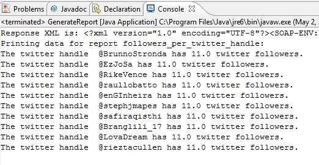

# Step 3: Print the Report Data on the Console

 

In Step 1 you looped over all possible Partner integrations. In Step 2, you created the getTwitterFollowersDataForDay method, which invokes the three On Demand scripts. In this section, you invoke the getTwitterFollowersDataForDay method from within the loop to return the report data in an array that you output to the console.



```
PHP Code
 

```

```
Java Code
 
for (IntegrationDetail integrationDetail : integrationDetails)
            {
                          /* Invoke getTwitterFollowersDataForDateRange method and
                 store result in twitterFollowersData */
                      Report twitterFollowersData = getTwitterFollowersDataForDateRange(integrationDetail, genesisIntegrationWebServicePortType);
                      
                      System.out.println("Printing data for report followers_per_twitter_handle: ");
                      
                      /* Print the data retrieved from running the script on the
              console */
                      if(twitterFollowersData != null)
                      {
                        ReportData[] twitterData = twitterFollowersData.getData();
                      
                            for(int i=0; i< twitterData.length;i++)
                            {
                              double[] twitter_followers = twitterData[i].getCounts();
                              for(int j=0; j< twitter_followers.length;j++)
                            {
                                    System.out.println("The twitter handle  "+twitterData[i].getName()+ " has "+twitter_followers[j]+ " twitter followers.");
                              }
                            }
                      }
                     
 }
```

```
C# Code
 
for (int i = 0; i < integrationDetails.Length; i++)
            {
                /* Invoke getTwitterFollowersDataForDateRange method and store result in twitterFollowersData */
                report twitterFollowersData = getTwitterFollowersDataForDateRange(integrationDetails[i], genesisIntegrationWebServicePortTypeClient);
 
                Console.WriteLine("Printing data for report followers_per_twitter_handle: ");
 
                /* Print the data retrieved from running the script on the console */
                if (twitterFollowersData != null)
                {
                    reportData[] twitterData = twitterFollowersData.data;
 
                    for (int j = 0; j < twitterData.Length; j++)
                    {
                        double[] twitter_followers = twitterData[i].counts;
                        for (int k = 0; k < twitter_followers.Length; k++)
                        {
                            Console.WriteLine("The twitter handle  " + twitterData[j].name + " has " + twitter_followers[k] + " twitter followers.");
                        }
                    }
                }
               
                /* Readline to keep console open */
                Console.ReadLine();
 
            }
```

**Parent topic:** [4. Partner Reports Tutorial](c_Create_Data_Connectors_Partner_Reports_using_the_Partner_API.md)

