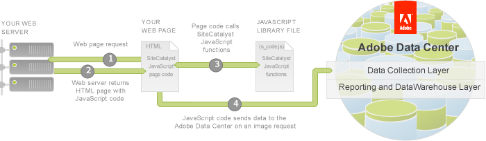

# Step 2: Review Analytics JavaScript Code in the JJ. Esquire Demo Application

 

Tagging is the process of adding JavaScript code to your web site pages to collect visitor data. You implement it with two elements:

-    **JavaScript page code**: A block of Analytics-specific JavaScript code that goes directly in the body section of each HTML page.
-    **JavaScript library file \(s\_code.js\)**: A collection of Analytics-specific methods and global Analytics variables stored in a separate file which is called from the JavaScript page code.

As each web page is requested in a browser, your web server returns the HTML page with the embedded JavaScript page code. The Analytics JavaScript page code sets the values for analytic data that you are collecting and calls Analytics-specific functions and global variables in the JavaScript library file \(**s\_code.js**\).

In this tutorial, you will add the Data Connectors JavaScript code to the Analytics JavaScript library file \(**s\_code.js**\) to retrieve product data. Once the product data has been retrieved you will be display it on the JJ. Esquire demo Product List page, and pass it to the Adobe Data Collection Layer.

In the next steps you will open the Integrate starter zip and review the files.

1.  Download the **Partner\_API\_integrate\_starter.zip** file from the [Download code files for this tutorial](c_Partner_Application_Configuration_for_Data_Connectors_Tutorial.md#) section of this article and extract the contents to your computer. You should see the files for the JJ. Esquire demo application.
2.  Move the files to a new web project in Eclipse or your IDE of choice.
3.  In the **js** folder, open the **s\_code.js** file. This is the Analytics JavaScript library file.

    The JavaScript page code uses "**s**" as the default reference object, which is instantiated in the library file \(**s\_code.js**\). You declare variables as members of this object, and values are assigned in the page code as well as in the library file.

4.  In the **s\_code.js** file, locate the **s\_account**, the**s.visitorNamespace**, and the **s.trackingServer** variables. You will replace the values for these variables with the values in your JavaScript library file.

    **Note:** You may need to ask your Adobe representative for the values of these Analytics-specific variables.

    1.  In the **s\_code.js** file, locate the **s\_account** variable and assign its value to your report suite ID.
    2.  In the **s\_code.js** file, locate the **s.visitorNamespace** variable and assign its value to your Company Login.

        **Note:** The **s.visitorNamespace** variable does not have to be set to your Company Login, but it usually is, by convention. This variable's purpose is to name the folder which stores the cookie that uniquely identifies the visitor.

    3.  In the **s\_code.js** file, locate the **s.trackingServer** variable and assign its value to your Adobe Data Center server.
5.  Open the Product List Page \(**list.html\)** file in a browser. Locate the Twitter promotion pod with the title, **Follow on Twitter**. This is where you will display the Twitter handle from the retrieved product data.

    

**Parent topic:** [3. Integrate Partner Data Tutorial](c_Integrate_Data_Connectors_Partner_Data_into_Customer_Application.md)

