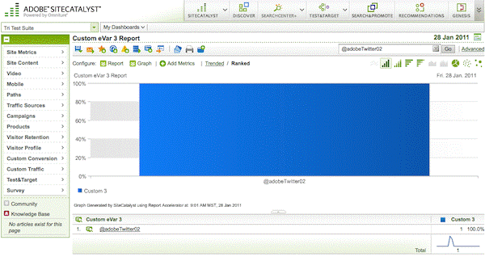

# Step 6: Run Analytics Reports to Verify Partner Data Collection

 

In this section you will verify the measurement data sent to Analytics by viewing the reports in your report suite.

1.  Log into the **Adobe Experience Cloud** and then select **Analytics** \> **Reports & Analytics** \> **View All Reports**.
2.  Make sure that the dropdown list in the upper right corner is set to your Report Suite Id.
3.  Go to **Custom Conversion \> Custom Conversion 1-10 \> Custom eVar3**.

You should see the **Custom eVar3 Report** with data for the Twitter handles that were assigned from Partner data.

 **Note:** Some data may not appear immediately in your reports. Simple traffic data should show up within 5 minutes. Conversion reporting and some pathing related reporting may take longer.

1.  Go to **Products \> Products**.

You should see the **Products Report** for follower\_count. If you do not see all the metric data for **Custom 3** do the following:

a. Click **Add Metrics.** 

b. When the pop-up window appears, double click **Custom 3** from the left column and it will be added to the right column.

c. Click **OK** to close the window.

You should now see data in the **Products Report**.

1.  Go to **Site Metrics \> Custom Events \> Custom Events 1-20 \> Custom 3.** 

You should see custom event3 data in the **Custom 3 Report**.

**Parent topic:** [3. Integrate Partner Data Tutorial](c_Integrate_Data_Connectors_Partner_Data_into_Customer_Application.md)

