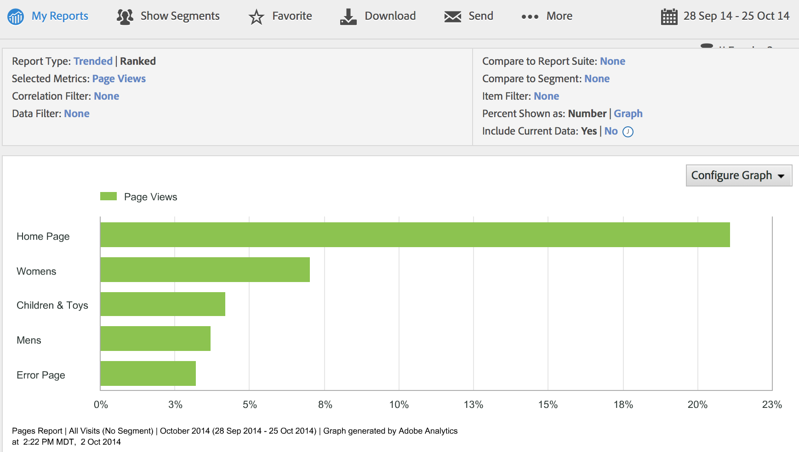

# Step 5: Verify Data Collection in Analytics

In this section you learn how to run reports in the Analytics UI to confirm that the data was collected.

1.  Log in to the **Adobe Experience Cloud** and click **Analytics** \> **Reports & Analytics**.
2.  Navigate to **View All Reports** \> **Site Content** \> **Pages Reports**.
3.  You should see the **Pages** reports with page views for the **Product Detail Page\*\***.

    

4.  Go to **Site Content** \> **Site Sections**.
5.  You should see the **Site Sections Report** with page views for **Womens Dept\*\***.
6.  Go to **Site Content** \> **Links** \> **Custom Links**.
7.  You should see the **Custom Links Report** with instances of the **Call Center Link\*\***.
8.  Go to **Products** \> **Products**.
9.  You should see the **Products Report** for SKU 100244. If no data appears, do the following:
10. Click **Add Metrics**.
11. When the pop-up window appears, double click **Product Views** from the left column to add it to the right column.
12. Click **OK** to close the window.
13. You should now see the product data for SKU 100244.
14. Go to **Custom Traffic** \> **Custom Traffic 1-10** \> **Custom Data Workbench 1**.
15. You should see the Custom Data Workbench 1 Report with data for Ski Jacket\*\*.

**Parent topic:** [Data Insertion API Tutorial](c_Data_Insertion_Overview.md)

