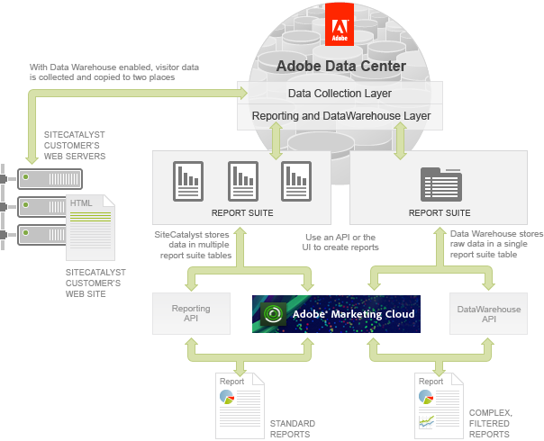

# Data Warehouse Overview

 

The following figure shows a high-level relationship between the Analytics and Data Warehouse products from a data storage and reporting perspective. In a typical Analytics implementation, the Analytics JavaScript Tagging code that is embedded in each page of your web site passes a visitor’s online analytics data to the Data Collection Layer. This data is stored in one or more report suites in your account.

When you have Data Warehouse enabled, the same raw, unprocessed analytics data is copied into a single table allowing more robust reporting options.

You can access your data for both Analytics and Data Warehouse from the Adobe Experience Cloud or through the respective APIs. As mentioned earlier, you can access thousands of standard reports in Analytics but will need Data Warehouse to create complex, filtered \(segmented\) reports.

**Note:** Because of to the complexity of Data Warehouse reports, they are not immediately available, can take up to 72 hours to generate, and are accessible via email, FTP or API delivery mechanisms.

**Parent topic:** [Data Warehouse API Tutorial](c_data_warehouse_API_tutorial.md)

