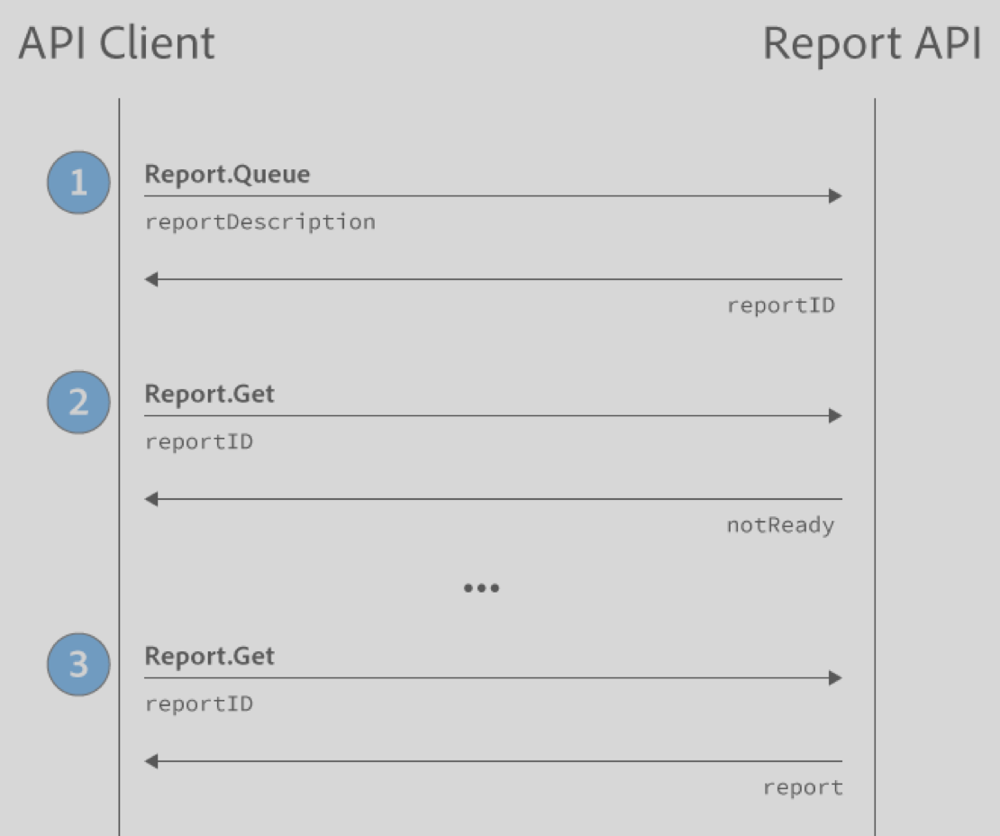

# Getting Started

 

Important Web Services v 1.2 and 1.3 API End-of-Life Notice:

Version 1.2 of the Web Services API was officially deprecated on February 20, 2014. It will reach end-of-life on September 15, 2016. At that time, Adobe will remove the ability of the API servers to respond to version 1.2 API requests. Any API requests made to the https://api.omniture.com/admin/1.2 endpoint will return a 410 error. Customers have until the end-of-life date to upgrade from the version 1.2 API to the version 1.4 API to prevent an outage in their API applications. See [API Support Policy](https://github.com/Adobe-Experience-Cloud/analytics-1.4-apis/blob/master/docs/getting-started/c_API_Support_Policy.md) for more information.

Version 1.3 will be officially deprecated as of September 15, 2016. Customers are encouraged to migrate to the 1.4 API to leverage the improvements described on this page.

To get started, review the [changes in 1.4](whatsnew.md#), update your endpoint, and then use the examples to start generating reports.

## Report Queue Workflow



1.  Open the API Explorer in Developer Connection.
2.  Send a request using Report API and the method Report.Queue. The Report API will return a report ID.
3.  Change the method to Report.Get using the report ID. There will be one of 2 responses:
    -   A "report not ready" response:

        ```
        {
        
        	"error":"report_not_ready",
        
        	"error_description":"Report not ready",
        
        	"error_uri":null
        
        }
        
        ```

    -   Or a return of the whole report.

Here are some best practices:

-   Check for a report every few seconds. Do not check more than once a second.
-   You can queue up multiple reports to be run concurrently.
-   The response from Report.Queue is exactly the same as the request for Report.Get.

## Endpoint

API requests should be sent to the 1.4 endpoint:

```
https://api.omniture.com/admin/1.4/
```

You might need to replace api.omniture.com with the URL that corresponds to your data center, as listed in the following table. In your production apps, we recommend calling Company.GetEndpoint to periodically refresh the endpoint programmatically, in case the URL changes.

-   api.omniture.com - San Jose
-   api2.omniture.com - Dallas
-   api3.omniture.com - London
-   api4.omniture.com - Singapore
-   api5.omniture.com - Pacific Northwest

## Removal of separate methods to generate different report types

If you are migrating from a previous version of the API, report types are now determined by the parameters of the `reportDescription` according to the following table:

|Report Type|Parameters|
|-----------|----------|
|Overtime Report|No elements with a dateGranularity specified.|
|Ranked Report|1 or more elements with no dateGranularity specified.|
|Trended Report|1 or more elements with a dateGranularity specified.|
|Pathing Report|Element in the pattern parameter.|
|Fallout Report|Element in the checkpoint parameter.|
|Summary Report|No "reportSuiteID" parameter, instead "reportsuite" is specified as the report element and the "selected" parameter contains a list of report suite IDs.|
|Real-Time Report|'source' parameter present and set to 'realtime'. Note that Real-Time Reports do not have to be queued, they can run immediately using [Report.Run](methods/r_Run.md#).|

The type derived is then returned in the result data as: ranked, trended, overtime, pathing, fallout, summary, or realtime.

## Using the API in the Browser

The API supports CORS and can be used in most modern browsers in a cross-domain way. This library provides a way to do [authentication with WSSE in Javascript](https://github.com/Adobe-Marketing-Cloud/analytics-realtime-dashboard-example/tree/master/js/marketing-cloud-javascript-sdk). If you decide to use the browser, keep the following in mind:

-   If you have a lot of users using the application, you will need to cache the results on a server. Do not publish a script on your public web site that pulls directly from the API.
-   Some older browsers do not support CORS. Make sure your users are using a newer browser when trying to access the API.

## Adobe Analytics Real-Time Dashboard Example

An example of how to create a real-time dashboard can be found on [github](https://github.com/Adobe-Marketing-Cloud/analytics-realtime-dashboard-example).

## Examples

In the following examples, replace "rsid" with your report suite id, and update the URL to use the correct endpoint.

```
//Simplest Request
https://api.omniture.com/admin/1.4/rest/?method=Report.Queue
{
    "reportDescription":{
        "reportSuiteID":"rsid"
    }
}

//overtime report
https://api.omniture.com/admin/1.4/rest/?method=Report.Queue
{
    "reportDescription":{
        "reportSuiteID":"rsid",
        "dateGranularity":"hour"
    }
}

//Ranked Report
https://api.omniture.com/admin/1.4/rest/?method=Report.Queue
{
    "reportDescription":{
        "reportSuiteID":"rsid",
        "elements":[
            {"id":"page"}
        ]
    }
}

//Trended Report
https://api.omniture.com/admin/1.4/rest/?method=Report.Queue
{
    "reportDescription":{
        "reportSuiteID":"rsid",
        "dateGranularity":"hour",
        "elements":[
            {"id":"page"}
        ]
    }
}

//Pathing Report -- NextPage Flow
https://api.omniture.com/admin/1.4/rest/?method=Report.Queue
{
    "reportDescription":{
        "reportSuiteID":"rsid",
        "metrics":[
            {"id":"pageviews"}
        ],
        "elements":[
            {"id":"page",
            "top":"10",
            "startingWith":"1",
            "pattern":[
                ["homepage"],
                ["::anything::"],
                ["::anything::"],
                ["::anything::"],
                ["::anything::"]
            ]}
        ]
    }
}

//Pathing Report -- PreviousPage Flow
https://api.omniture.com/admin/1.4/rest/?method=Report.Queue
{
    "reportDescription":{
        "reportSuiteID":"rsid",
        "metrics":[
            {"id":"pageviews"}
        ],
        "elements":[
            {"id":"page",
            "pattern":[
                ["::anything::"],
                ["::anything::"],
                ["::anything::"],
                ["::anything::"],
                ["homepage"],
            ]}
        ]
    }
}
            
//Pathing Report -- Fallout
https://api.omniture.com/admin/1.4/rest/?method=Report.Queue
{
    "reportDescription":{
        "reportSuiteID":"rsid",
        "metrics":[
            {"id":"pageviews"}
        ],
        "elements":[
            {"id":"page",
            "checkpoints":[
                "homepage",
                "/templates/choose-your-powerpoint-fonts-wisely/"
            ]}
        ]
    }
}
 
// Real-Time Report
// Note the inclusion of "source" equals "realtime"
// Make sure you configure Real-Time reports for the report suite
https://api.omniture.com/admin/1.4/rest/?method=Report.Run
{
    "reportDescription": {
        "source": "realtime",
        "reportSuiteID": "rsid",
        "metrics": [
            { "id": "revenue" }
        ]
    }
}

// Real-Time Report with sort options
https://api.omniture.com/admin/1.4/rest/?method=Report.Run
{
    "reportDescription": {
        "source": "realtime",
        "reportSuiteID": "rsid",
        "sortMethod": "mostPopular:.25:0:linear",
        "metrics": [
            { "id": "pageviews" }
        ]
    }
}

// Summary Report
// Note that the "reportSuiteID" parameter is not included
// and the elements list contains "reportsuite"
// Report suites are provided in the "selected" element
https://api.omniture.com/admin/1.4/rest/?method=Report.Queue
{
    "reportDescription":{
        "date":"2014",
        "metrics":[
            {
                "id":"pageviews",
            },
            {
                "id":"revenue",
            },
        ],
        "elements":[
            {
                "id":"reportsuite",
                "selected":[
                    "rsid1",
                    "rsid2"
                ]
            }

        ],
    }
}

//Error Message 
https://api.omniture.com/admin/1.4/rest/?method=Report.Queue
{
    "reportDescription":{
        "reportSuiteID":"rsid",
        "dateGranularity":"hours"
    }
}

//Validate Report Definiton (without Queuing it)
https://api.omniture.com/admin/1.4/rest/?method=Report.Validate
{
    "reportDescription":{
        "reportSuiteID":"rsid",
        "dateGranularity":"hours"
    }
}

//GetMetrics
https://api.omniture.com/admin/1.4/rest/?method=Report.GetMetrics
{
    "reportSuiteID":"rsid",
    "existingElements":["page"]
}

//GetElements
https://api.omniture.com/admin/1.4/rest/?method=Report.GetMetrics
{
    "reportSuiteID":"rsid",
    "existingMetrics":["pageviews"]
}
```

