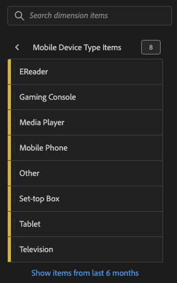

# Dimensions that use enumerated lists

* mobile manufacturer	
* mobile screen size
* mobile screen height
* mobile cookie support
* mobile image support
* mobile color depth
* mobile audio support
* mobile video support
* mobile drm
* mobile net protocols
* mobile os
* mobile java vm
* mobile bookmark length
* mobile url length
* mobile email length
* mobile device number
* mobile push to talk
* mobile mail decoration
* mobile information services
* mobile device type
* browser type
* browser
* connection type
* mobile carrier
* cookie
* customer loyalty
* java enabled
* language
* color depth
* monitor resolution
* plugin
* operating system
* referrer type
* search engine
* state
* geo country
* geo region
* geo city
* geo dma
* persistent cookie
* paid search

## How to get a list of dimension items

* Log into https://experience.adobe.com 
* Launch Analytics
* Open or create a new Analysis Workspace project
* Search for the desired dimension using the Search components field in the top left corner
* Click the arrow on the right side of the desired dimension

Here is an example showing the dimension items for Mobile Device Type:

For more information about Mobile Dimensions see the [Analytics Mobile Dimensions Documentation](https://experienceleague.adobe.com/docs/analytics/components/dimensions/mobile-dimensions.html?lang=en)
