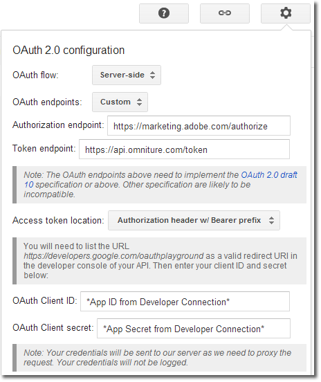
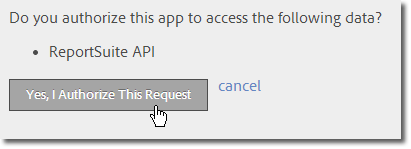
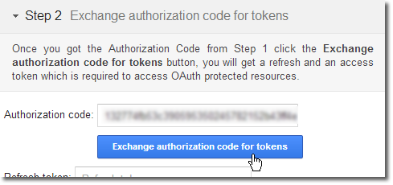
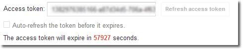
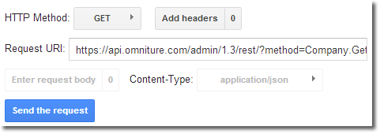
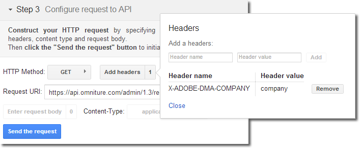

# 3-Legged Authentication using Google OAuth Playground

 

Complete the following tasks to perform a sample authentication workflow.

## Configure the Request

Browse to [https://developers.google.com/oauthplayground/](https://developers.google.com/oauthplayground/), and click the configuration gear in the right corner. Provide the following configuration:



|Option|Value|
|------|-----|
|OAuth Flow|Server-Side|
|OAuth Endponts|Custom|
|Authorization Endpoint| `https://marketing.adobe.com/authorize` |
|Token Endpoint| `https://api.omniture.com/token` |
|Access Token Location|Authorization header w/ Bearer prefix|
|OAuth ClientID| [Application name](auth_register_app.md#) |
|OAuth Client Secret| [Application secret](auth_register_app.md#) |

## Provide a Scope

See [Authentication Scope Reference](auth_scope.md#).

## Request an Authorization Code

Click **Authorize** and complete the flow until you are returned to the OAuth playground with an authorization code.



## Exchange Authorization Code for a Token

Click **Exchange authorization code for tokens**. The access token can be copied and used in API requests until the expiration time listed.





## Send a Test Request

You can construct an API request to test the authentication directly in the OAuth playground. For example:

```
https://api.omniture.com/admin/1.3/rest/?method=Company.GetReportSuites
```



If your Adobe ID is linked with multiple login companies, you can select which company is used for each API request by including the `X-ADOBE-DMA-COMPANY` header in the API request.



**Parent topic:** [OAuth 2 Authentication](auth_overview.md)

