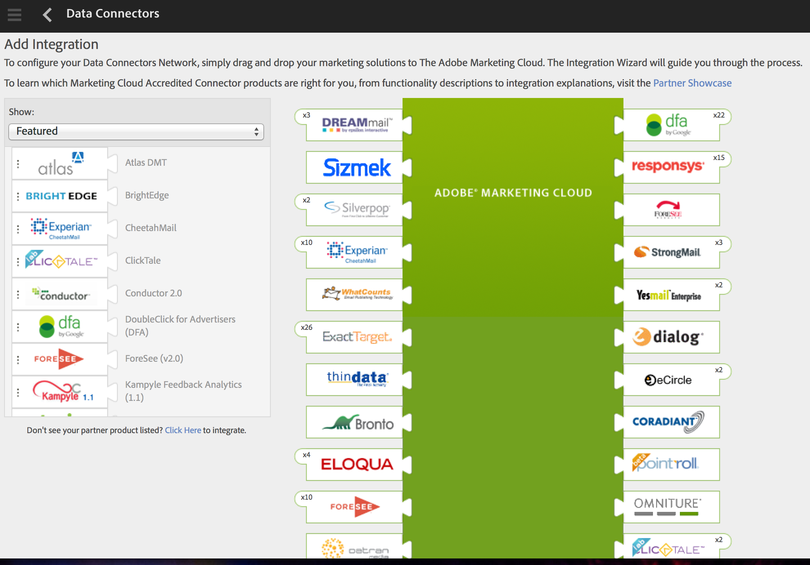

# Step 1: Active the Integration for your Analytics Report Suite

 

The Data Connectors Partner created the Integration Wizard in the [2. Partner Application Configuration Tutorial](c_Partner_Application_Configuration_for_Data_Connectors_Tutorial.md#) tutorial. Now, you, the Customer, will execute the Adobe Integration Wizard to activate the product for your Analytics report suite.

Analytics data is stored in customer-specific repositories called report suites. Refer to the [Authentication and Setup Tutorial](c_Authentication_and_Setup.md#) for information about creating a report suite.

1.  Log in to your sandbox in the Adobe Experience Cloud.
2.  Navigate to **Adobe Experience Cloud** > **Data Connectors**.

    In the left navigation, you should see the integrated marketing solutions. These solutions are the integrations which have been created by Data Connectors Partners. For this demo, you will use the **JJ Esquire Twitter Demo** solution.

3.  Drag the **JJ Esquire Twitter demo** solution from the **Featured** tab on the left and drop it in to the Adobe Marketing Cloud plugin on the right (one of the shapes with the dotted outline).

    Once you do this, the Integration Wizard will guide you through the steps to activate this solution.

     

4.  In the Data Connectors Integration dialog window, enter the Integration Name as **JJEsquire_TweetFollowers**. You will use this name to identify the integration for this demo.
5.  On the **Designate eVars** screen, map the **Twitter handle** data defined by the Partner to the **eVar3** custom conversion variable (or any available **eVar** variable) in Analytics for the JJ. Esquire web site.

    **Note:** You can use any available **eVar** variable and custom event in this section. The custom conversion variables,**eVar1** and **eVar2**, and the custom events, **Event1** and **Event2**, are used in this tutorial.

6.  On the **Designate Events** screen, map the number of **Twitter followers** from the Partner to the **Event3** custom event (or any available event) in Analytics for the JJ. Esquire web site.
7.  Click **Save** to complete and activate the Integration Wizard.

Now that the Data Connectors product is active for your Analytics report suite, the Adobe Engineering team takes this information and builds the Data Connectors JavaScript code, which you will then add to the Analytics JavaScript library code (**s_code.js**) for the JJ. Esquire demo application.

**Parent topic:** [3. Integrate Partner Data Tutorial](c_Integrate_Data_Connectors_Partner_Data_into_Customer_Application.md)

