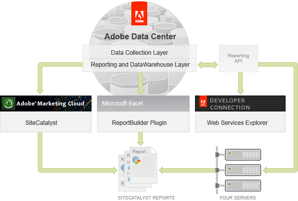

# Analytics Reports Overview

The following figure illustrates the four mechanisms for accessing Analytics data.

Notice that the Analytics UI is part of the Adobe Experience Cloud and Report Builder is a plugin to Microsoft Excel. The Web Services Explorer is a standalone tool, available from the Adobe Developer Connection, that allows you to test requests and responses to the Reporting API. The Reporting API allows you to programmatically generate reports.

## An overview of the Reporting API

 

The Reporting API allows you to programmically create and run reports and is the focus of the rest of this article. In this article you will learn how to:

1. Request the report.

2. Check for report availability.

3. Display the returned report in a console.

The Reporting API has both REST and SOAP interfaces, but this article focuses on SOAP.

**Parent topic:** [Reporting API Tutorial](c_Reporting_API_Tutorial.md)

