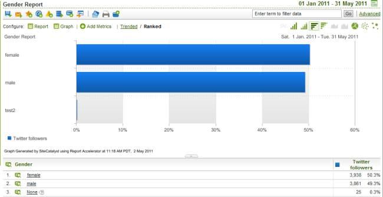

# Step 6: Check the Classified Data in the Analytics UI

 

Adobe Data Connector Partners do not have access to the Analytics UI to run reports. In this section, you will learn how to run a report using the Partner API to verify that the classification creation and import were successful.

1.  In the Analytics UI, use the top menu to navigate to **Adobe Experience Cloud > Analytics > Reports & Analytics > View All Reports**.
2.  Next, navigate to **Custom Conversion > Custom Conversion 1-10 > Twitter handle Reports > Gender** to see the classified data for gender.

    You should see the **Gender Report**. If you do not see all the metric data for **Twitter followers**, do the following:

3.  Select **Add Metrics** on the Gender Report screen.
4.  When the pop-up window appears, drag the **Twitter followers** metric from the **Available Metrics** column on the left to the **Report Data Columns Canvas** column on the right.
5.  Click **OK** to close the window.

    You should now see the **Twitter followers** data in the **Gender Report**.

    

**Parent topic:** [5. Classify Partner Data Tutorial](c_Classify_Partner_data_using_the_Partner_API.md)

