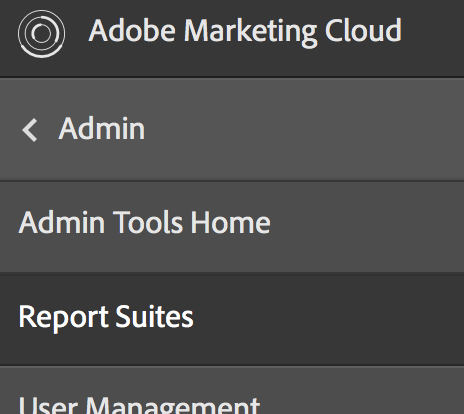
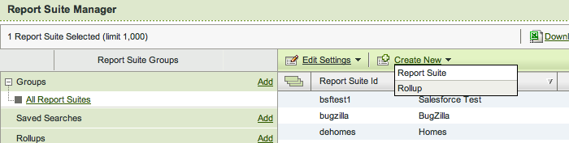

# Step 1: Create a Report Suite

Analytics data is stored in customer-specific repositories called report suites. In this section you will create a new report suite for this series of articles and tutorials. If you do not have authenticated access to the Adobe Experience Cloud, you will need to ask your administrator to set up a report suite for this series and to give you the report suite ID.

**An important note about the data and report suite for this series** 

If you plan to explore only the Collect visitor analytics using Analytics JavaScript Tagging tutorial or the Collect visitor analytics using the Data Insertion API, you can stop here because these tutorials do not require authenticated access to the APIs.

If you plan on executing the provided code in the other articles, you will need to finish the steps in this tutorial to setup authenticated access to the APIs. You will also need to follow the steps in the Collect visitor analytics using Analytics JavaScript Tagging tutorial so that you will have data in your report suite for the other articles.

1.  In the Experience Cloud, select **Analytics** > **Admin** > **Report Suites**.

    

2.  Select **Create New** > **Report Suite** in the Report Suite Manager.

    

3.  Make sure the first dropdown list is set to **Create from a Template** and then select **Basic Commerce**.
4.  Locate the **Report Suite ID** field and set the value to jjesquire. You will see your new report suite ID previewed below the **Report Suite ID** field. It should include an automatic prefix, which is often the company name.
5.  Set the **Site Title** to **JJEsquire Getting Started Suite**. You will see this title used within the Analytics UI. You will need the report suite ID in your code.
6.  Select a **Time Zone** from the dropdown.

    All data that comes into this report suite will be recorded based on this defined time zone.

7.  Leave the **Base URL** and **Default Page** fields empty.

    These two values are only used from the Adobe Experience Cloud interface to link to your web site. The fields are not required.

8.  Leave the **Go Live Date** set to today. The Go Live Date determines the day when the report suite is activated.
9.  In the Estimated Page Views Per Day field, type 100. Use this field to estimate the number of page views you anticipate for your web site per day. This estimate allows Adobe to put in place the appropriate amount of hardware to process the data you will be collecting.
10. Select a **Base Currency** from the dropdown. All currency data that comes into this report suite will be converted and stored in this currency format.
11. Click **Create Report Suite**. You should see the page refresh with a message that your report suite has been successfully created.

**Parent topic:** [Authentication and Setup Tutorial](c_Authentication_and_Setup.md)

