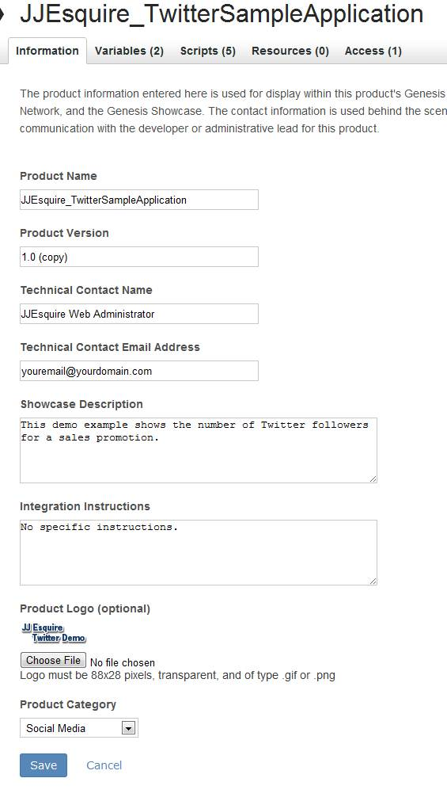
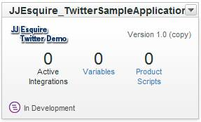

# Step 1: Create the Integration Wizard

 

In this section, you will access the Dev Center and create a new Integration Wizard for your product.

1.  Log into the Developer Connection.
2.  Select the **Dev Center** menu tab.
3.  Click the **My Products** button.
4.  Click the **Add Product** link.
5.  Fill out the form that appears as shown in Figure 4.

    - Use your own email address for the **Technical Contact Email Address** field.
    - Upload the logo from the ZIP file in the **Downloads** section of this tutorial.
    

6.  Click the **Save** button. You will see your product integration defined.

    

**Parent topic:** [2. Partner Application Configuration Tutorial](c_Partner_Application_Configuration_for_Data_Connectors_Tutorial.md)

