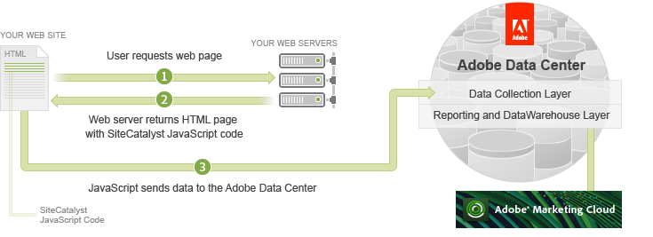
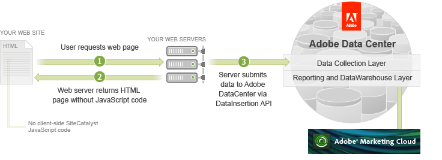

# Data Collection

 

If you explored the Collect visitor analytics using Analytics JavaScript Tagging tutorial, you know that embedded Analytics JavaScript code in each of your web pages passes data to the Adobe Data Collection Layer on the query string of an image request.

The collected data can be viewed by running reports in the Analytics UI or by using some of the other APIs, as listed on the Getting Started home page.

The Data Insertion API alternatively uses server-side code to send the tracking data. When the user requests a web page, the web server returns the page without any of the embedded Analytics JavaScript code to the browser. As the user browses the site, the web server uses the Data Insertion API to pass data to the Adobe Data Collection Layer. The data is then checked for syntax errors and processed. The Adobe Data Collection Layer will return an HTTP POST response with the status.

As with client-side tagging, the data is now available for access through the Adobe Experience Cloud or through the other APIs.

Your decision to use either client- or server-side data collection is based on the same concerns that you might have for any client- or server-side processing needs. These include, but are not limited to:

- Disabled JavaScript in a browser that might prevent data processing
- Protecting sensitive information that you do not want viewable in the browser
- Limitations of mobile devices or TV boxes that cannot run JavaScript code
- Bandwidth considerations of making extra communications from your web servers

The rest of this article focuses on server-side data collection using the Data Insertion API.

**Parent topic:** [Data Insertion API Tutorial](c_Data_Insertion_Overview.md)

