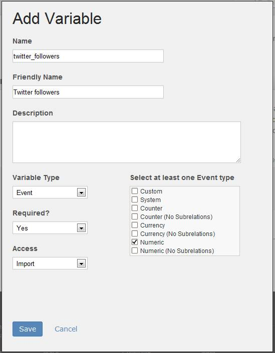

# Step 3: Define a Custom Event

 

In this section, you will define a custom event that stores the Twitter follower count for the Twitter handle. For this demo application, you will define a custom event named **twitter_followers**, with a friendly name of **Twitter followers**.

**Note:** To learn more about custom conversion variables and custom events, see the [What are the available Analytics variables and events?](c_What_are_the_available_Analytics_variables_and_events.md#) 

1.  Click the **Add Variable** link again to define an event for your integration.
2.  Fill out the form fields as shown.

1.  Click **Save** to return to the summary box.

**Parent topic:** [2. Partner Application Configuration Tutorial](c_Partner_Application_Configuration_for_Data_Connectors_Tutorial.md)

