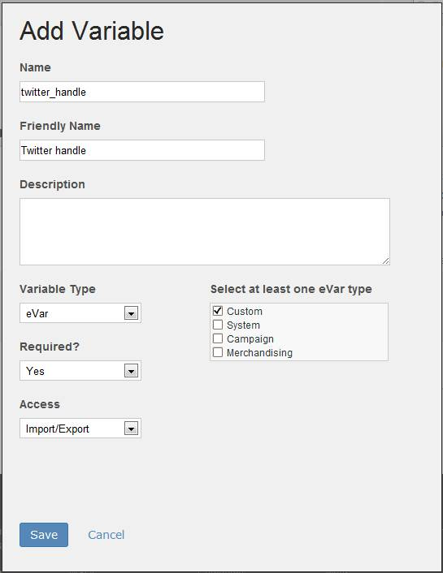

# Step 2: Define the Product Variable

 

Customers will integrate your data connectors product data into their web site or other applications. This requires them to map their variables to your product variables. In this section, you define your project variables. In tutorial 3, [3. Integrate Partner Data Tutorial](c_Integrate_Data_Connectors_Partner_Data_into_Customer_Application.md#), Customers will map their variables to this definition.

For this demo application, you will define a custom conversion variable, or eVar, named **twitter_handle**, with a friendly name of **Twitter handle**.

**Note:** To learn more about custom conversion variables and custom events, see the [What are the available Analytics variables and events?](c_What_are_the_available_Analytics_variables_and_events.md#)

1.  Click on the **Variables** link in the box shown in Figure 6 to define the variable for your integration.
2.  Click the **Add Variable** link to launch the **Variable Manager** form.
3.  Fill out the form fields as shown.

    

4.  Click **Save** to return to the summary box shown in Figure 5.

**Parent topic:** [2. Partner Application Configuration Tutorial](c_Partner_Application_Configuration_for_Data_Connectors_Tutorial.md)

