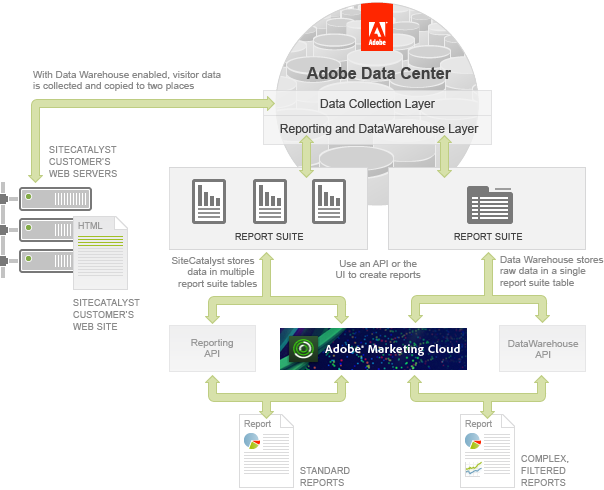
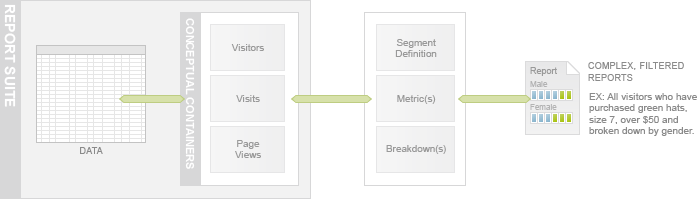

# How is data stored?

 

Adobe operates multiple data centers for collecting, processing and storing the data associated with your Experience Cloud.

Each customer's data is stored based on their Login Company, which is the Company entity that they use to login to the Experience Cloud portal.

 

## An overview of report suites

A report suite defines a walled-off collection of associated reports. Usually you would define one report suite for one web site, but there are cases where you might have multiple report suites for one web site or one report suite for multiple web sites. You should work with your Adobe representative to design the right report suite configuration for your business.

## An overview of Data Warehouse

The Data Warehouse stores raw data in a single table but sorts it, based on type, into three conceptual containers: Visitors, Visits and Page Views. Data Warehouse reports are based on filters called segment rules or segment definitions. These rules define what data to include or exclude for each report and can have very specific criteria.

You can further refine Data Warehouse reports by declaring metrics, to add additional columns of data, or breakdowns, to group data.

