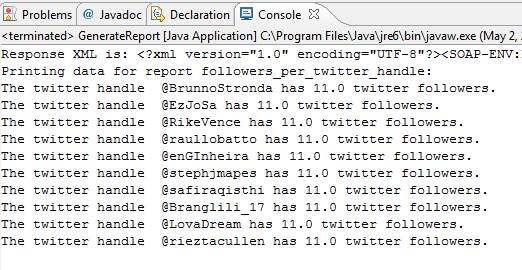
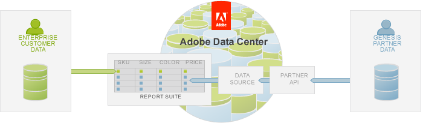
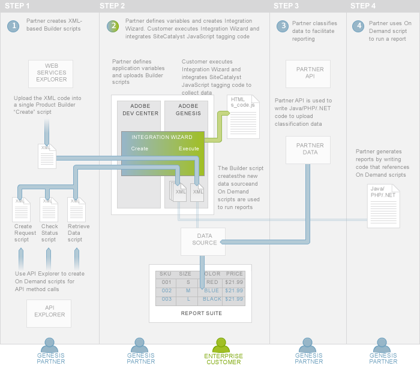

# 6. Import Bulk Data Tutorial

 

In the first four tutorials of the series, Partners learned how to package On Demand scripts for reporting with product variables to create the Integration Wizard. Customers learned how to activate the product integration. Partners also learned how to run reports that included data from both their own and Customer data collections. In the fifth article of the series, Classify Partner data using the Partner API, you learned how to create Product Builder scripts to classify data using the Partner API.

In this article, you will learn how to import this external data by:

-   Creating a new data source using the Product Builder Create script.
-   Packaging the Product Builder script into the Integration Wizard.
-   Assuming the role of the Customer, in this case, JJ. Esquire, to execute the Integration Wizard. This will run the Product Builder script and generate the new data source.
-   Writing Java, C\# or PHP code to import the off-line sales data from the campaign into JJ. Esquire's report suite using the Partner API.
-   Lastly, you will also learn how to run a report using the same On Demand scripts you created in the first tutorial of the series, **Create On Demand scripts to generate reports**. The On Demand scripts will allow you to create a report to verify that the bulk data was imported.

## Prerequisite knowledge, system permissions and environment setup

-   This article is for PHP, Java or C\# developers with web and XML experience.
-   Partners must have a Developer Connection account to be able to create scripts. Follow the directions in the Setup your environment and authenticated access to the Partner API.

## Download code files for this tutorial

This article displays code inline to the discussion but you can also download the code for PHP, Java or C\# to explore on your own.

-   [Partner\_API\_importing\_PHP.zip](http://microsite.omniture.com/t2/api-xml/en_US/get_started/zips/Partner_API_importing_PHP.zip) 
-   [Partner\_API\_importing\_Java.zip](http://microsite.omniture.com/t2/api-xml/en_US/get_started/zips/Partner_API_importing_Java.zip) 
-   [Partner\_API\_importing\_C\#.zip](http://microsite.omniture.com/t2/api-xml/en_US/get_started/zips/Partner_API_importing_C_sharp.zip) 

Follow the directions in the Setup your environment and authenticated access to the Partner API and then unzip these files to your project folder.

## An overview of importing bulk data using the Partner API

Consider this scenario: A Analytics Customer has collected data about its e-commerce store in a report suite. You have created a data connectors product that allows store visitors to hold products, pick them up and pay for them at specific locations in their cities. This offline data is not available in the Customer's report suite but they want you to provide it so they can run more complete reports about their products and revenue.

You can use the Partner API to import bulk data to the Customer's report suite. The following figure shows that you will upload your data, using the Partner API, to a temporary queue called a *data source*. From there, the Adobe Data Center will process and validate the data before importing it into the Customer's report suite.

Importing data involves two steps:

1.   **The creation of the data source** using Product Builder scripts.
2.   **The import of data into the data source** using the Partner API and code that you write in Java, PHP or .NET.

You will learn how to perform both of these steps in the remainder of this article.

##  **An overview of creating data sources using a Product Builder script** 

You use Product Builder scripts to create a new data source in your Analytics report suite. Once the data source is created, you can later upload data to it using the Partner API.

There are two types of Product Builder scripts, *create* and *edit*. Some tasks require both, but creating data sources only requires the create script because data sources are not edited once you created them. You create Product Builder scripts using the Adobe API Explorer, which is a web interface that allows you to select web services methods and see the associated request and response structures.

**Note:** In the **Create On Demand scripts to generate reports** tutorial, you used Report Builder and Adobe API Explorer to generate On Demand scripts. However, Report Builder cannot access the Adobe Admin API, which is required to create a data source. Therefore, you will only use the Adobe API Explorer for this article.

Product Builder scripts automate processes that you want to initialize during data connectors product integration. Therefore, you will package them in the Integration Wizard that the Customer will execute.

## An overview of importing bulk data into the report suite

As you learned in earlier tutorials and articles of this series, a Customer will execute the Integration Wizard. Since the Product Builder script is part of the wizard, it will run, which will create the new data source \(see Step 2 in the following figure\).

Now you, as the Partner, can upload new data into the data source by writing Java, PHP or .NET code that accesses the Partner API \(Step 3 in the following figure\).

Once the Product Builder script has been run in the Customer's environment, Partners can generate reports on the imported data using On Demand scripts \(Step 4 in the following figure\).

**Note:** To learn more about using On Demand scripts to create reports, work through the first four tutorials of this series.

-   **[Step 1: Generate Product Builder Script using API Explorer](c_Generate_Product_Builder_Script_using_API_Explorer.md)**  
 
-   **[Step 2: Upload the data source Product Builder Script to the Integration Wizard](c_Upload_the_data_source_Product_Builder_Script_to_the_Integration_Wizard.md)**  
 
-   **[Step 3: Customer Execution of the Integration Wizard](c_Customer_Execution_Import.md)**  
 
-   **[Step 4: Import Bulk Data](c_Import_Bulk_Data.md)**  
 
-   **[Step 5: Verify Imported Data by Creating a Report](c_Verify_Imported_Data_by_Creating_a_Report.md)**  
 

