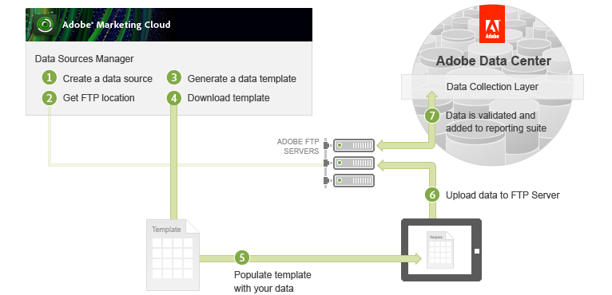

# Importing Batch Data

 

This section outlines the two options for importing data in batches to the Adobe Data Collection Layer for integration with your Adobe Online Experience Cloud data.

## Data Sources Manager UI and FTP

The first way to upload batch data uses the Data Sources Manager, which is part of the Adobe Experience Cloud web portal:

Once you have logged into the portal, select Admin \> Data Source Manager, where you will \(1\) create a data source, \(2\) receive an FTP location for your data upload, and \(3\) generate a data template using the Data Source Activation Wizard.

**Note:** The data you import must be in a specific format. The data template creates all of the proper header details in a convenient tab-delimited data file.

Next, you can \(4\) download the template and \(5\) populate it with data. Lastly, you will \(6\) upload the file to the assigned Adobe FTP server, which places the file in the processing queue. Adobe \(7\) performs basic data formatting validation on the file and then imports the data into the appropriate reporting suite.

For more information about using the Data Sources Manager UI and FTP to upload batch data, see the [Data Sources Help](http://microsite.omniture.com/t2/help/en_US/sc/datasources/).

## Using the Data Sources API

The second way of uploading batch data uses the Data Sources API and is the focus of this article.

In this option, creating data sources, uploading data and monitoring the upload process is all performed programmatically. In the following sections of this article you will learn how to:

-   Use a data source setup method to create the data source.
-   Use an information method to retrieve the new Data Source ID.
-   Add data to the new data source.
-   Monitor the data upload process until completion.

This article shows how to connect to the Data Sources API using a SOAP interface. Be sure to read the [Authentication and Setup Tutorial](c_Authentication_and_Setup.md#) for directions on downloading the WSDL, authentication and environment setup.

**Parent topic:** [Data Sources API Tutorial](c_Data_Sources_Overview.md)

