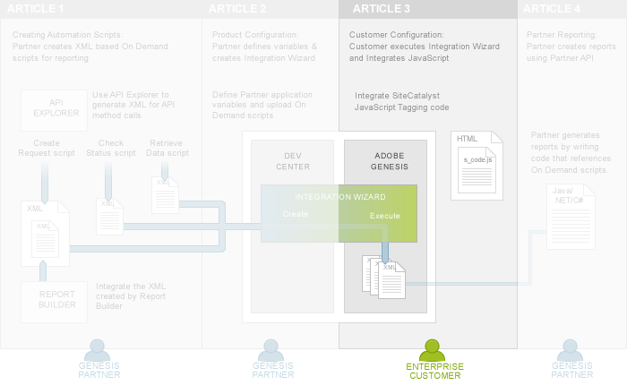
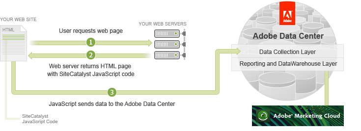
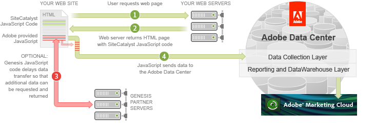

# 3. Integrate Partner Data Tutorial

 

In the first two tutorials of the series, [1. On Demand Scripts Tutorial](c_scripting.md#) and [2. Partner Application Configuration Tutorial](c_Partner_Application_Configuration_for_Data_Connectors_Tutorial.md#), Partners learned how to create On Demand scripts for Partner reports and how to upload them during the creation of the Integration Wizard. The Integration Wizard packages all of the scripts, variables and data needed for Customer integration and automates the process of mapping Partner and Customer variables to each other.

While the other tutorials and articles in this series are focused on Partner tasks, this one is focused on Customer tasks. As a Partner, keep in mind that you are performing the Customer's role to help you better understand the product integration process.

In this tutorial, you will learn how to execute the data connectors product Integration Wizard and then add the data connectors-provided JavaScript code to your existing Analytics JavaScript code. This will pass data connectors product data back to the Adobe Data Collection Layer along with your Analytics online analytics data.

**Note:** This tutorial assumes that you know how to collect Analytics metrics using Analytics JavaScript Tagging.

## Prerequisite knowledge, system permissions and environment setup

- This article is for web developers with knowledge of HTML and JavaScript.
- You must have a valid *Report Suite ID* in order to complete this tutorial. Follow the directions in the [Authentication and Setup Tutorial](c_Authentication_and_Setup.md#).

## Download code files for this tutorial

This tutorial displays code inline to the discussion but you can also download the code for PHP, Java or C# to explore on your own.

-  [Partner_API_integrate_starter.zip](http://microsite.omniture.com/t2/api-xml/en_US/get_started/zips/Partner_API_integrate_starter.zip) 
-  [Partner_API_integrate_solution.zip](http://microsite.omniture.com/t2/api-xml/en_US/get_started/zips/Partner_API_integrate_solution.zip) 

Follow the directions in the [Authentication and Setup Tutorial](c_Authentication_and_Setup.md#) article.

## An overview of Data Connectors integration

Before Analytics Customers can use a data connectors product, they must first run the data connectors product Integration Wizard and map some of their application variables and events to the data connectors product's variables and events.

Once the Customer has run the Integration Wizard, the Adobe Engineering team takes the information from the active integration and builds the *Data Connectors JavaScript code*. The Customer then adds this JavaScript code to their existing Analytics JavaScript library file (**s_code.js**).

Once you have integrated the Analytics JavaScript code into your web pages, each web page request sends analytics data to the Adobe Data Collection Layer.

When you integrate data connectors product data, you can optionally delay the JavaScript processing to the Adobe Data Collection Layer so that the system has time to retrieve the necessary data from the Partner servers (see Figure 4).

**Note:** Data connectors products are created by Partners. The product data may come from either Adobe or Partner servers.

In this tutorial, you will perform the following steps to integrate the data connectors product data into your own application:

1.   [Step 1: Active the Integration for your Analytics Report Suite](c_Active_the_Integration_for_your_Analytics_Report_Suite.md#) 
2.   [Step 2: Review Analytics JavaScript Code in the JJ. Esquire Demo Application](c_Review_Analytics_JavaScript_Code.md#) 
3.   [Step 3: Add Data Connectors JavaScript Code to your Analytics JavaScript Library File](c_Add_Data_Connectors_JavaScript_Code_to_your_Analytics_JavaScript_Library_File.md#) 
4.   [Step 4: Display Product Data in the JJ. Esquire Demo Application](c_Display_Product_Data_in_the_JJ._Esquire_Demo_Application.md#) 
5.   [Step 5: Verify retrieval of Partner Data using AdobePulse Debugger](c_Verify_retrieval_of_Partner_Data_using_Adobe_DigitalPulse_Debugger.md#) 
6.   [Step 6: Run Analytics Reports to Verify Partner Data Collection](c_Run_Analytics_Reports_to_Verify_Partner_Data_Collection.md#) 

Once the data connectors product data has been sent to the Adobe Data Center it will be included in Analytics reports. You will learn more about how the Partners can pull reports on this integrated data using the Partner API in the [4. Partner Reports Tutorial](c_Create_Data_Connectors_Partner_Reports_using_the_Partner_API.md#) and the [7. Data Warehouse Tutorial](c_Create_a_Data_Warehouse_Report_using_the_Partner_API.md#) articles.

- **[Step 1: Active the Integration for your Analytics Report Suite](c_Active_the_Integration_for_your_Analytics_Report_Suite.md)**  
 
- **[Step 2: Review Analytics JavaScript Code in the JJ. Esquire Demo Application](c_Review_Analytics_JavaScript_Code.md)**  
 
- **[Step 3: Add Data Connectors JavaScript Code to your Analytics JavaScript Library File](c_Add_Data_Connectors_JavaScript_Code_to_your_Analytics_JavaScript_Library_File.md)**  
 
- **[Step 4: Display Product Data in the JJ. Esquire Demo Application](c_Display_Product_Data_in_the_JJ._Esquire_Demo_Application.md)**  
 
- **[Step 5: Verify retrieval of Partner Data using AdobePulse Debugger](c_Verify_retrieval_of_Partner_Data_using_Adobe_DigitalPulse_Debugger.md)**  
 
- **[Step 6: Run Analytics Reports to Verify Partner Data Collection](c_Run_Analytics_Reports_to_Verify_Partner_Data_Collection.md)**  
 

