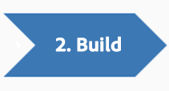
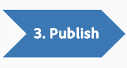

# Partner Overview

 

The Adobe Experience Cloud Exchange enables technology partners to develop pre-built data integrations and applications with Adobe Experience Cloud for customers to discover and use. The Exchange is an effective way for partners to integrate one time while making their integration available to all Adobe customers.

Building an Exchange integration or application is a three-step process:

1.  [Plan](c_Plan_an_Integration.md#): Determine what you are going to build by learning about Experience Cloud products and developer resources, and by speaking with your Adobe Experience Cloud customers.

2.  [Build](c_Build_an_Integration.md#): Request developer access to Adobe products & SDKs, and create your Exchange integration or application.

3.  [Publish](c_Publish_to_the_Exchange.md#): Submit your completed integration or application for publication in the Exchange.

 

View the following sections to get started creating an integration for the Experience Cloud Exchange:

  

-   **[Plan an Integration](c_Plan_an_Integration.md)**  
 
-   **[Build an Integration](c_Build_an_Integration.md)**  
 
-   **[Publish to Exchange](c_Publish_to_the_Exchange.md)**  
When you are ready, gather the information you need and submit the request form.

