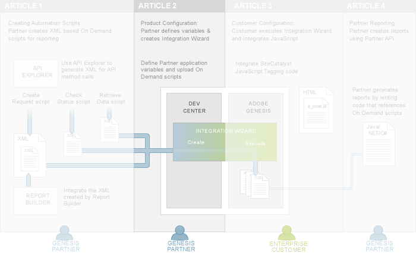

# 2. Partner Application Configuration Tutorial

 

In the first tutorial of the series, [1. On Demand Scripts Tutorial](c_scripting.md#), you learned how to create On Demand scripts, which are necessary to create Partner reports. You will learn how to create the reports in [4. Partner Reports Tutorial](c_Create_Data_Connectors_Partner_Reports_using_the_Partner_API.md#), after data is available from the [3. Integrate Partner Data Tutorial](c_Integrate_Data_Connectors_Partner_Data_into_Customer_Application.md#).

In this second tutorial, you will learn how to upload these scripts during the creation of the Integration Wizard. The Integration Wizard packages all of the scripts, variables and data needed for the Customer to integrate the data connectors product and automates the process of mapping Partner and Customer variables to each another.

This tutorial walks you through the steps of creating the Integration Wizard that Customers will use. You will define the custom conversion variable that is used to store the Twitter handle of the visitor and an event that is used to store the follower count for each handle.

## Prerequisite knowledge, system permissions and environment setup

-   This tutorial is for web developers with XML experience.
-   Partners must have a Developer Connection account to create scripts. Follow the directions in the Setup and Security article.

## Download code files for this tutorial

You can download the following solution files to compare against your finished code.

-    [Data Connectors\_configure\_starter.zip](http://microsite.omniture.com/t2/api-xml/en_US/get_started/zips/Data_connectors_configure_starter.zip) 

## An overview of product configuration

Data connectors product configuration requires that a Partner creates an Integration Wizard that is then executed by a Customer.

As Partners configure their products for data connectors, they will define variables and upload specialized XML scripts, like the On Demand scripts you created in tutorial 1, for reporting purposes.

-   **[Step 1: Create the Integration Wizard](c_Create_the_Integration_Wizard.md)**  
 
-   **[Step 2: Define the Product Variable](c_Define_the_Product_Variable.md)**  
 
-   **[Step 3: Define a Custom Event](c_Define_a_Custom_Event.md)**  
 
-   **[Step 4: Upload On Demand Scripts for Reporting](c_Upload_On_Demand_Scripts_for_Reporting.md)**  
 
-   **[Step 5: Customer Execution of the Integration Wizard](c_Customer_Execution_Partner.md)**  
 

