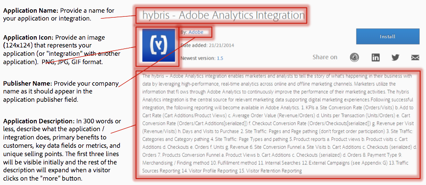
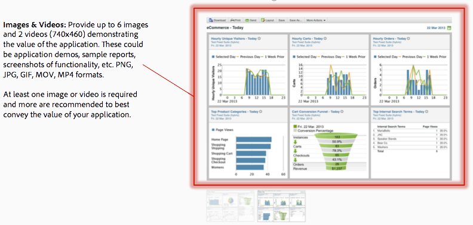
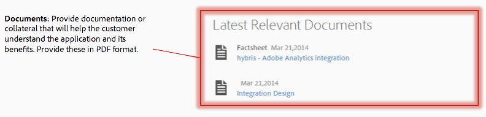

# Publish to Exchange

When you are ready, gather the information you need and submit the request form.

## Required App Listing Content

You'll need the following content to submit the listing form:

## Submit your Integration or Application

When you are ready to submit your integration or application, submit the request form using the following link:

[Adobe Experience Cloud Exchange Application Listing Form](https://adobe.allegiancetech.com/surveys/HR7AWQ/) 

After reviewing your submission, Adobe will schedule a meeting for you to demonstrate your integrated solution. If approved for the Exchange, your integration or application will initially appear as beta. Once it has been tested by several beta customers who provide feedback, the beta label will be removed.

**Parent topic:** [Partner Overview](c_Marketing_Cloud_Exchange.md)

