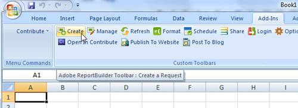
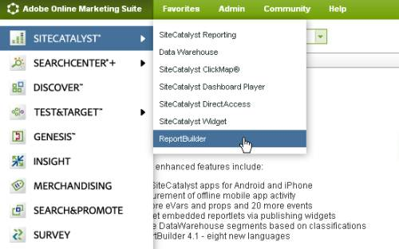
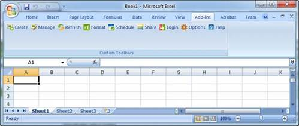
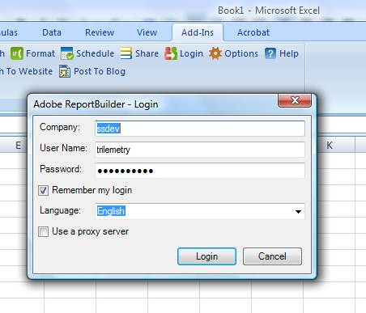

# Report Builder

 

Report Builder is a plug-in for Microsoft Excel that is designed for users who want to perform additional analysis or manipulation of their Analytics data from within Excel.

In this tutorial, you will use Report Builder for the specific purpose of generating XML parameter values to use in your On Demand scripts.

To learn more about this tool, log in to Adobe Experience Cloud and select **Analytics > Report Builder**.

In the following steps, you will download, install and authenticate yourself to use Report Builder.

1.  Log into the Adobe Online Experience Cloud and select **Analytics > Report Builder**.

    

2.  Click the **Download Now** button to download Report Builder.
3.  After you download Report Builder, follow the instructions on the download screen to install it.
4.  Launch Excel to see the new Report Builder options under the **Add-Ins** tab.

    

5.  Select **Login** to enter the same user name and password you use to log into your Analytics account.

    

6.  Select **Options** and check the box to **Log the requests/responses**. This ensures that Report Builder is set to log API requests which will appear under **My Documents** on your computer in a file named **Report Builder-out.log**.

**Parent topic:** [Partner API Overview](c_tutorials.md)

