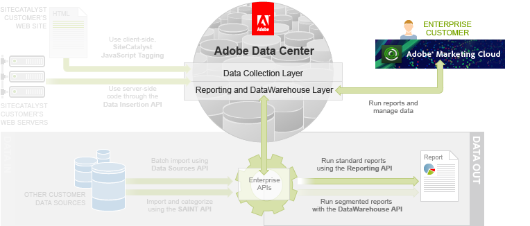

# Reporting API Tutorial

In this article you will learn how to run reports on collected Analytics analytics data like traffic sources, campaigns, and visitor retention.

Reports are primarily retrieved using two mechanisms:

- The Analytics user interface (UI)
- The Reporting API

You will also learn about two additional tools:

- Report Builder to work with Analytics data in Microsoft Excel
- The Web Services Explorer to validate API requests and responses

The bulk of this article focuses on the Reporting API, which allows more flexibility and customization options than the Analytics UI.

The following figure illustrates this API’s role relative to the others in the Enterprise API.

## Prerequisite knowledge, system permissions and environment setup

This article is for PHP, Java or C# developers with web experience.

Analytics customers must be authenticated to use the Reporting API. Follow the directions in the [Authentication and Setup Tutorial](c_Authentication_and_Setup.md#) article.

- **[Analytics Reports Overview](c_Analytics_Reports_Overview.md)**  
The following figure illustrates the four mechanisms for accessing Analytics data.
- **[Demo Application](c_demo_application_reporting.md)**  
 
- **[Step 1: Define and Queue the Report](c_report_define.md)**  
The first step in creating a report is to determine the report type. The Reporting API provides three report types:
- **[Step 2: Check the Report Status](c_report_status.md)**  
All of the report queuing methods place the defined report into a queue for processing.
- **[Step 3: Retrieve the Report Data](c_report_retrieve.md)**  
In PHP, you use the `getReport()` method to retrieve the report object and then loop through the data elements to print the data on the console.

