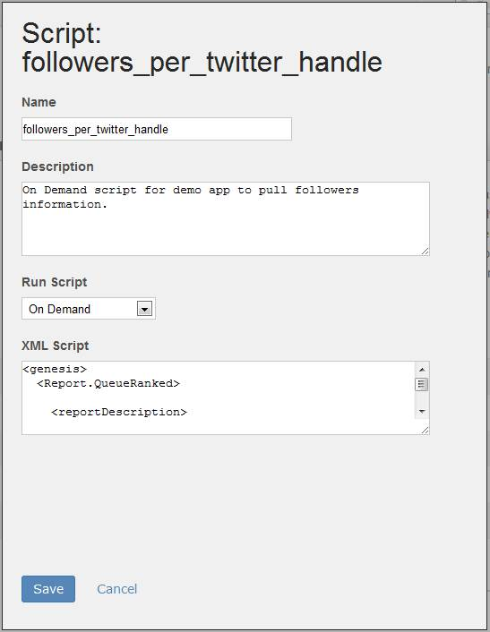
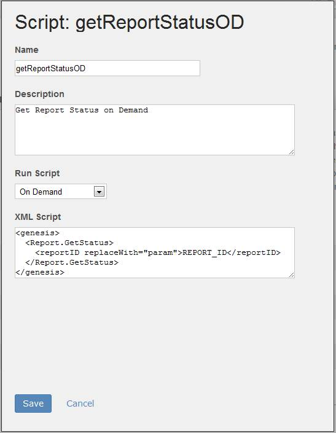
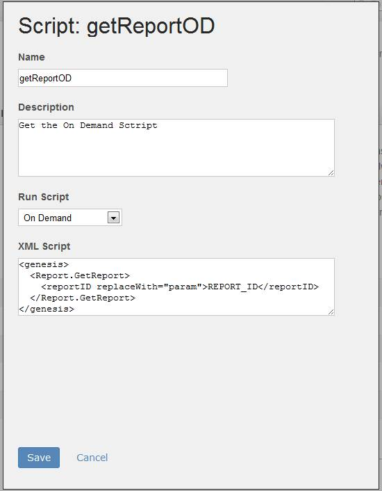

# Step 4: Upload On Demand Scripts for Reporting

 

In the first tutorial of the series, [1. On Demand Scripts Tutorial](c_scripting.md#), you learned how to create On Demand scripts, which are necessary to create Partner reports. In this section, you upload these scripts to package them in the Integration Wizard.

For this JJ. Esquire demo application, you will upload three On Demand scripts: create report request, check status of request and retrieve report data. You will need to copy-and-paste the XML code for each of the On Demand scripts that you created in the previous tutorial.

1.  Select the **Product Scripts** link in the summary box to upload the script.
2.  Select **Add Script** to launch the **Script Manager**.
3.  Fill out the form as shown, based on the **followers\_per\_twitter\_handle** script you created in the previous tutorial.

    **Note:** A copy of each script is available in the ZIP from the **Downloads** section of this tutorial.

4.  Click **Save** to save the script and return to the summary box.

    

5.  Select the **Add Script** link again to add the Check Status On Demand script.
6.  Fill out the form fields as shown, based on the **getReportStatusOD** script you created in the previous tutorial.

    

7.  Click **Save** to save the script and return to the summary box.
8.  Select **Add Script** a third time to add the Retrieve Report On Demand script.
9.  Fill out the form fields as shown, based on the **getReportOD** script you created in the previous tutorial.

    

10. Click **Save** to save the script and return to the summary box.

The Integration Wizard is now complete and is ready for the Customer to execute from the data connectors environment in Adobe Experience Cloud UI.

**Parent topic:** [2. Partner Application Configuration Tutorial](c_Partner_Application_Configuration_for_Data_Connectors_Tutorial.md)

