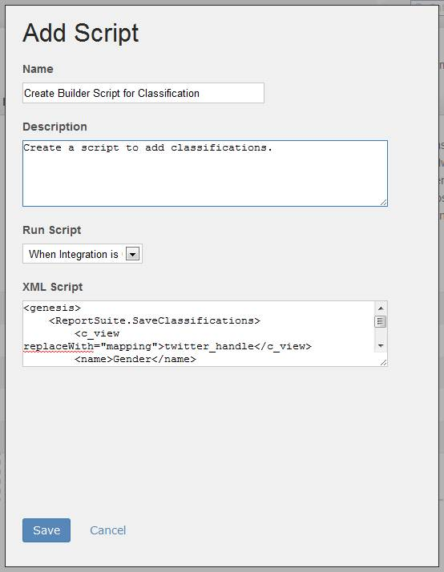
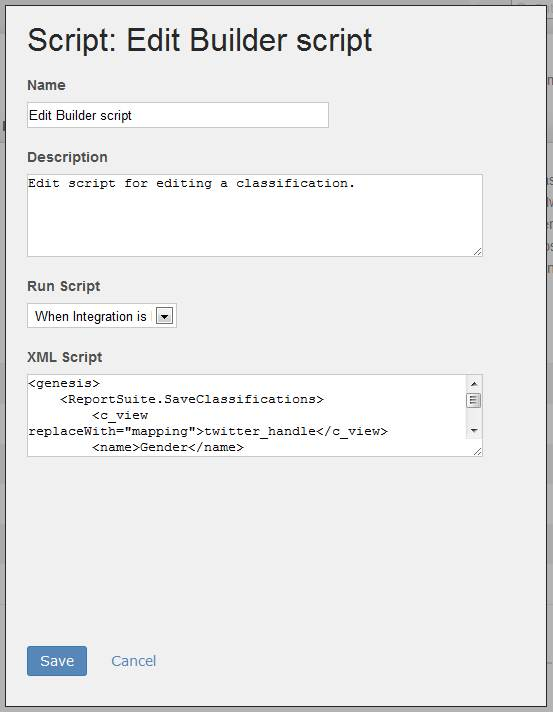

# Step 3: Upload the Classification Product Builder Script to the Integration Wizard

 

In this section, you will upload the Product Builder scripts you created in previous sections to the Integration Wizard.

**Note:** You have created an Integration Wizard in tutorial 2 \(**Configure the Partner application for Data Connectors integration**\) of this series. For that tutorial, you defined On Demand scripts for reporting. In this section, you will follow almost exactly the same steps except this time you will use Product Builder scripts to create the classifications.

1.  In the top menu of the **Developer Connection**, click the **Dev Center** link.
2.  Click the **My Products** button in the **Define My Products** section.
3.  Select the **Product Scripts** link in the summary box to upload the script.
4.  Select **Add Script** to launch the **Script Manager** and add the "Create Builder Script for Classification".
5.  Fill out the form as shown in the following screen. You will need to copy-and-paste the XML code for the Create Product Builder script, called**ClassificationCreateProductBuilderScript.txt**, that you created in the previous sections of this article.

    **Note:** If you did not create your own script in the previous section, you can use the script available in the ZIP from the **Downloads** section of this tutorial.

    

6.  Click **Save** to save the script and return to the summary box.
7.  Select **Add Script** link again to add the "Edit Builder Script for Classification" script.
8.  Fill out the form fields as shown in the following screen. You will need to copy-and-paste the XML code for the Edit Product Builder script, named**ClassificationEditProductBuilderScript.txt**, that you created in the previous sections of this article.

    

9.  Click **Save** to save the script and return to the summary box.

The Product Builder scripts are now packaged with the Integration Wizard, which is ready for the Customer to execute from the data connectors environment in the Adobe Experience Cloud.

**Parent topic:** [5. Classify Partner Data Tutorial](c_Classify_Partner_data_using_the_Partner_API.md)

