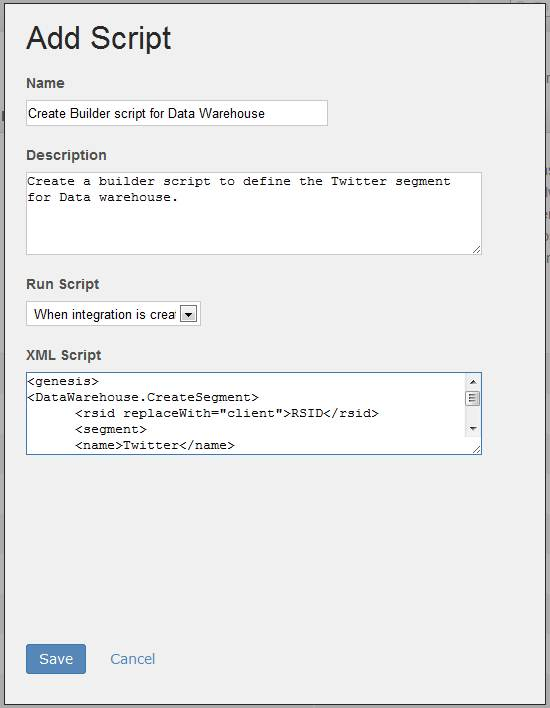

# Step 3: Upload the Data Warehouse Product Builder Script to the Integration Wizard

 

In this section, you will upload the Product Builder script you created in the previous section to the Integration Wizard.

**Note:** You have created an Integration Wizard in tutorial 2 \([2. Partner Application Configuration Tutorial](c_Partner_Application_Configuration_for_Data_Connectors_Tutorial.md#)\) of this series. For that tutorial, you defined On Demand scripts for reporting. In this section, you will follow almost exactly the same steps except this time you will use Product Builder script to create the segment definition for a Data Warehouse report.

1.  In the top menu for the **Developer Connection**, click the **Dev Center** link.
2.  Click the **My Products** button in the **Define My Products** section.
3.  Select the **Product Scripts** link in the summary box to upload the script.
4.  Select **Add Script** to launch the **Script Manager** and add the "Create Builder Script for Data Warehouse".
5.  Fill out the form as shown in Figure 7. You will need to copy-and-paste the XML code for the Create Product Builder script, called**DataWarehouseProductScript.txt** that you created in the previous sections of this article.

    **Note:** If you did not create your own script in the previous section, you can use the script available in the ZIP from the **Downloads**section of this tutorial.

    

6.  Click **Save** to save the script and return to the summary box.

The Product Builder script is now packaged with the Integration Wizard, which is ready for the Customer to execute from the data connectors environment in the Adobe Experience Cloud.

**Parent topic:** [7. Data Warehouse Tutorial](c_Create_a_Data_Warehouse_Report_using_the_Partner_API.md)

