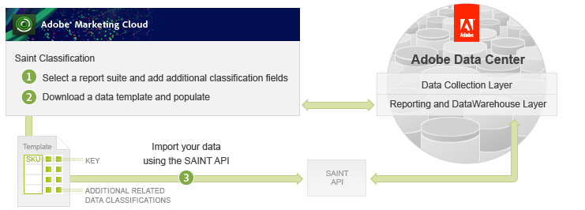

# Using the SAINT Classifications API

 

The second way of importing and classifying data uses the SAINT Classification API and is the focus of this article. You will learn how to use a provided data template to import and classify data programmatically with the SAINT API.

In the following sections of this article you will learn how to:

- Determine whether a report suite is enabled for classification.
- Create new classification fields.
- Create an import job.
- Populate the import job with new data.
- Commit the import job for processing.
- Verify that the data is imported and classified.
- Create an export job.

Creating export jobs supports a workflow for you to export some or all the classified records for updating and later import.

**Parent topic:** [SAINT API Tutorial](c_SAINT_API_Overview.md)

