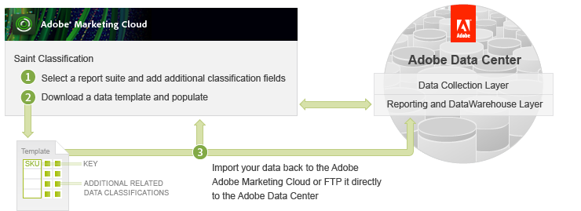

# Using the SAINT Classifications UI

 

The first way of classifying data for a key value uses the SAINT Classifications UI in the Adobe Experience Cloud portal.

Once you have logged into the portal, you can \(1\) access the Admin \> Admin Console to create the new classification fields in the appropriate report suite. You can think of a classification as a new column of data associated with the report suite.

The data that you import using SAINT must be in a specific format so Adobe provides you with the option to \(2\) download a data template with all the proper header details in a tab-delimited data file. You can add your new data to this template and then \(3\) import the data file in the browser, using FTP.

For more information about using the UI to create the data template, import and classify data, see the [SAINT classifications User Guide](http://microsite.omniture.com/t2/help/en_US/sc/saint/oms_sc_saint.pdf).

**Parent topic:** [SAINT API Tutorial](c_SAINT_API_Overview.md)

