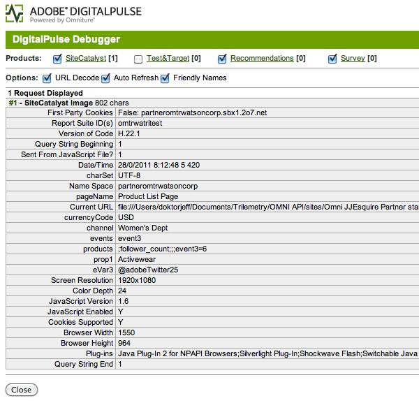

# Step 5: Verify retrieval of Partner Data using AdobePulse Debugger

 

In this section, you will use the AdobePulse Debugger to verify the variable data being sent to Analytics while you step through the JJ. Esquire demo application. The Debugger is a data packet analyzer which opens in your browser when you click on the bookmark which you will define to run the debugger.



In this section you will add the Digital Pulse Debugger if you don't already have it as a bookmark.

1.  Create a bookmark or favorite in your browser of choice.
2.  Replace the URL in the bookmark with the following JavaScript code. This code will launch the Debugger in your browser when you click on this bookmark.

**Digital Pulse Debugger code** 

```
 javascript:void(window.open(%22%22,%22dp_debugger%22,%22width=600,height=600,location=0,menubar=0,status=1,toolbar=0,resizable=1,scrollbars=1%22).document.write(%22%3Cscript%20language=%22JavaScript%22%20id=dbg%20src=%22http://www.digitalpulse.omniture.com/dp/debugger.js%22%3E%3C/%22+%22script%3E%22));
```

1.  Open the demo**referring_page.html** page in your browser.
2.  Click the link on the page. It will take you to the **JJ.Esquire Product List** page.
3.  Click the **Digital Pulse Debugger** bookmark.

If you get a browser security message about popup windows, allow the popup.

1.  You should see a small pop-up window with the Debugger in it.
2.  Uncheck the **Test&Targe**t, **Recommendations** and **Survey** checkboxes so that you can focus on the **Analytics** variables.

The Debugger will refresh as you move from page to page, showing you the data collected across your entire site.

1.  Since you are viewing the **Product Lis**t page, the Debugger displays the variables for that page.

You should see the Analytics variables eVar3, events, and products are populated with the Partner data.

1.  Click the **Fur-Trim Ski Jacket**.
2.  View the variable values in the Debugger for the **Product Detail** page.

You will not see the partner data on this page since the partner data is only being assigned to Analytics variables on the Product List page.

To learn more about the Debugger, read the [Digital Pulse Debugger documentation](http://blogs.omniture.com/2010/11/17/meet-the-new-digitalpulse-debugger/). To view additional data packet information as it flows across the network, you may want to also use a packet analyzer.

**Parent topic:** [3. Integrate Partner Data Tutorial](c_Integrate_Data_Connectors_Partner_Data_into_Customer_Application.md)

