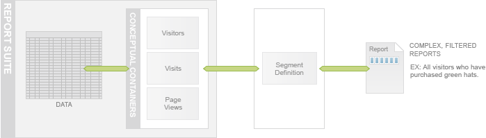
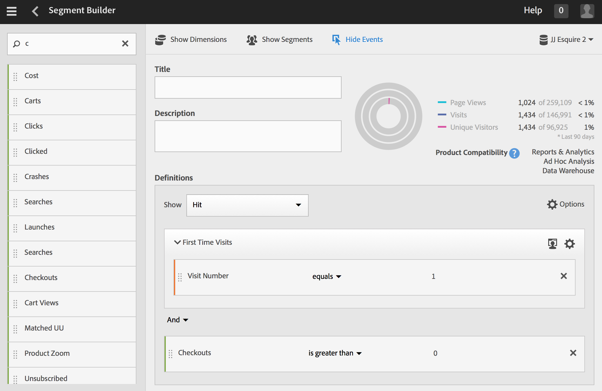
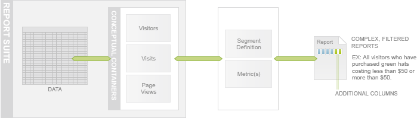
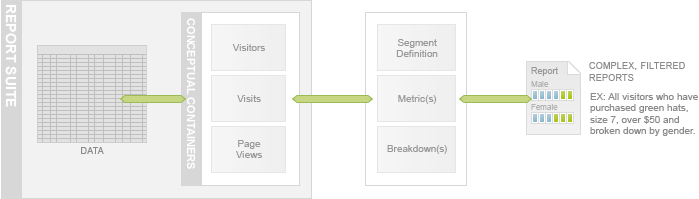

# What are segment definitions?

 

Adobe Analytics lets you build, manage, share, and apply powerful, focused audience segments to your reports using Analytics capabilities, the Adobe Experience Cloud, Adobe Target, and other integrated Adobe products.

## Segmentation

[Data Warehouse](https://marketing.adobe.com/resources/help/en_US/reference/data_warehouse.html) stores raw data in a single table but allows you to access the data in three conceptual containers: Visitors, Visits and Hits. You include or exclude data in your reports using segment rules or segment definitions. A typical segment definition comprises a conceptual container and a rule that filters the data in that container.

You can create and run segments using the Data Warehouse API, the Adobe Analytics UI in the Segment Builder (shown), and in Ad Hoc Analysis.

For more information on segmentation, see the [Analytics Segmentation Guide](http://microsite.omniture.com/t2/help/en_US/analytics/segment/).

## Metrics

A [metric](https://marketing.adobe.com/resources/help/en_US/reference/metrics.html) is a number that represents a count or a ratio for something you want to measure. Examples of metrics are revenue, number of visits, and number of page views.

You can define multiple metrics while creating a segment and they are represented as additional data columns in your report.

## Breakdowns

Use [breakdowns](https://marketing.adobe.com/resources/help/en_US/sc/user/breakdowns.html) when you want to know more about how a report item or segment relates to other reports. This is often called "breaking down" a report by another report. A breakdown is the action of integrating two or more correlated items (traffic reports) or two sub-related items (conversion reports).

Data Warehouse provides predefined breakdown variables or you can define your own variables from custom eVars or props variables.

