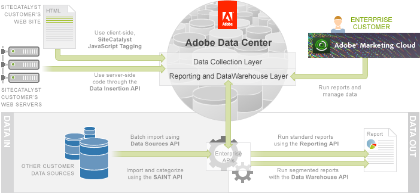

# Data Warehouse API Tutorial

 

Analytics provides users with an exhaustive set of standard reports. You can get very good, actionable information from these reports, however, you might encounter situations where you need to generate reports with more advanced data relationships. You can use Data Warehouse for this purpose.

Data Warehouse is a product, like Analytics, in the Adobe Online Experience Cloud. If your contract enables Data Warehouse, then you can use it to answer more complex questions than you can with the standard reports. For instance, a standard report may answer your question: What are the exit pages in my web site for all visitors? A Data Warehouse report could answer the question: What are the exit pages in my web site for first-time visitors who purchased the green shoes?

Other questions you could answer using Data Warehouse reports are:

- How many first time visits is a new product line getting on my web site?
- Which products are usually removed from the shopping cart on an exit page?
- What are the most common products purchased by my loyal customers?

In this article, you will get an overview of Data Warehouse and how to use the Segment Definition Builder to define filters on a Data Warehouse report. Then you will learn how to run these reports in both the UI and using the Data Warehouse API. The Enterprise API includes the Data Warehouse API to run reports on advanced, filtered (segmented) data.

There are 4 steps for running a data warehouse report using the Data Warehouse API:

1.  Create a request
2.  Check the status of the Data Warehouse request
3.  Create a delay until the status returns “completed”
4.  Retrieve the report

You will learn how to perform these actions in the rest of this article.

The following figure illustrates the role of the Data Warehouse API relative to the others in the Enterprise API.

## Prerequisite knowledge, system permissions and environment setup

This article is for PHP, Java or C# developers with web experience.

Analytics customers must be authenticated to use the Reporting API. Follow the directions in the [Authentication and Setup Tutorial](c_Authentication_and_Setup.md#) article.

- **[Data Warehouse Overview](c_data_warehouse_overview.md)**  
 
- **[Segments, Metrics, and Dimensions](c_data_warehouse_segments.md)**  
 
- **[Demo Application](c_Demo_Application.md)**  
 
- **[Create a Data Warehouse Report in the UI](t_create_a_datawarehouse_report_in_the_UI.md)**  
 
- **[Run a Data Warehouse Report in the UI](t_run_a_data_warehouse_report_in_the_UI.md)**  
 
- **[Step 1: Create a Request](c_create_a_request.md)**  
 
- **[Step 2: Check the Request Status](c_check_the_request_status.md)**  
 
- **[Step 3: Sleep Until the Status Returns](c_sleep_until_the_status_returns.md)**  
 
- **[Step 4: Retrieve the Report](c_retrieve_the_report.md)**  
 

