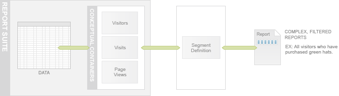
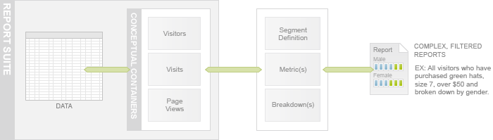

# Segments, Metrics, and Dimensions

 

Data Warehouse stores raw data in a single table but allows you to access the data in three conceptual containers: Visitors, Visits and Hits and include or exclude data in your reports using segment rules or segment definitions. A typical segment definition comprises a conceptual container and a rule that filters the data in that container.

In this article, you will learn how to use the Adobe Experience Cloud UI to create and run segment definitions. You can also create and run them using the Data Warehouse API, but creating them with the API is outside the scope of this article. In this article you will create the segment definition in the Segment Builder UI and then run it using the API.

## Metrics

You can add data points to your report using a metric list. A metric is a number that represents a count or a ratio for something you want to measure. Examples of metrics are: revenue of a product, number of visits and number of page views.

You can define multiple metrics while creating a segment and they are represented as additional data columns in your report.

## Dimensions

Reports can be further refined by using breakdowns, also known as dimensions, which are a way to group data, for instance by age, gender, browser height, campaigns, days since last visit, etc. Figure 6 shows a report breakdown by gender.

Data Warehouse provides predefined breakdown variables or you can define your own variables from custom eVars or props variables.

**Parent topic:** [Data Warehouse API Tutorial](c_data_warehouse_API_tutorial.md)

