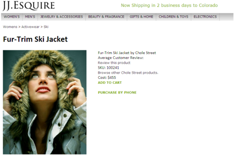

# Demo Application

 

All of the articles and tutorials in this series are based on Adobe’s JJ. Esquire demo application [http://jjesquire.com](http://jjesquire.com). An earlier article of this series, Collect visitor analytics using Analytics JavaScript Tagging tutorial, walks you through the steps of adding Analytics JavaScript Tagging code to four pages in the simplified JJ. Esquire demo application. The tagging code sends analytics data for each of the pages to the Adobe Data Collection Layer.

In this article, you will learn how to use the Analytics Reporting API to retrieve and display reports based on this collected data, specifically on the Fur-Trim Ski Jacket.

This product report displays the product SKU, revenue and the brand classification created in the [Data Sources API Tutorial](c_Data_Sources_Overview.md#).

**Parent topic:** [Reporting API Tutorial](c_Reporting_API_Tutorial.md)

