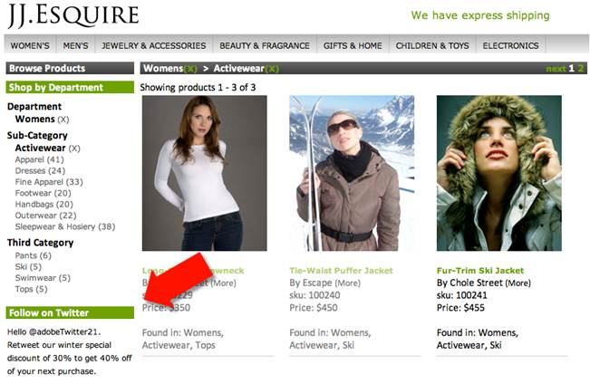

# Demo Application Overview

 

All of the articles and tutorials in this series are based on Adobe's JJ. Esquire demo application that is based on the JJ. Esquire site, [http://jjesquire.com](http://jjesquire.com).

In this demo application, JJ. Esquire (the Analytics Customer) is running a Twitter campaign that rewards customers for tweeting about the winter special. To capture the Twitter handle and number of followers for the customer, JJ. Esquire will purchase a product created by a fictional Partner.

This integration will allow JJ. Esquire to retrieve the Twitter handle and follower count from the Partner's servers to display on their web site, collect into their Analytics data and facilitate the discount.

**Parent topic:** [Partner API Overview](c_tutorials.md)

