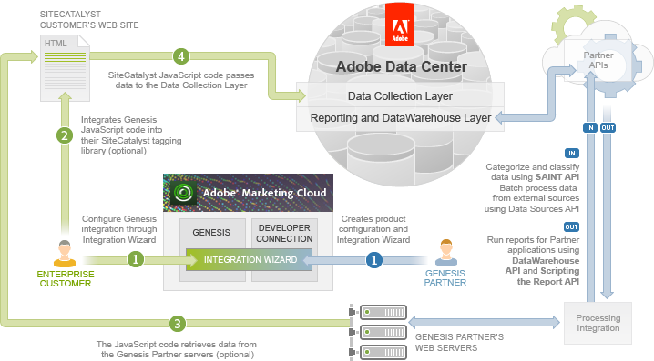
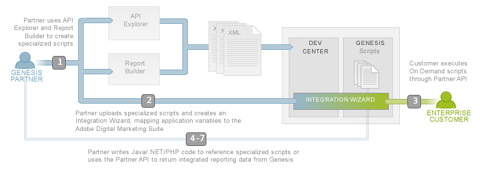

# Partner API Overview

 

The Partner API is designed to integrate third-party partner data into the Adobe Experience Cloud. Customers can purchase these partner applications and integrate the data into their report suite using the data connectors Integration Wizard.

This figure shows the two sides of the Partner integration:

Partners use the Partner API and Developer Connection web site to (1) Configure the product, thus creating the Integration Wizard and to (2) process the integration by managing data and running reports.

Experience Cloud Customers use the Integration Wizard to map the partner data to their own Adobe Experience Cloud data collection.

## Overview

Data connectors has two audiences: Partners and Customers. Partners have applications to sell to Customers of the Adobe Experience Cloud, and both have tasks to perform in a data connectors product integration. The previous figure outlines the tutorials in this series and the roles and tasks for each audience.

**Note:** This series is written for Partners who will perform all these tasks during the development phase. However, you must also understand how these tasks will be performed in the real production environment when Partners and Customers each have a role. In these tutorials, some of the tasks you perform are for the Customer role.

The central tasks that define the integration are in the Partner Application Configuration and Partner Data Integration tutorials, when the Partner creates the Integration Wizard and the Customer executes it. The following figure emphasizes these tasks and also illustrates the roles and tasks outlined in all the tutorials and articles, by number.

| Tutorial /Article | Who | Task |
|---------------------|-------|--------|
|  [1. On Demand Scripts Tutorial](c_scripting.md#)  | Partner |Partners do not have access to reports in the Adobe Experience Cloud. In this tutorial, Partners learn how to create specialized On Demand scripts to generate reports.|
|  [2. Partner Application Configuration Tutorial](c_Partner_Application_Configuration_for_Data_Connectors_Tutorial.md#)  | Partner | In this tutorial, Partners learn how to configure their application for data connectors by mapping variables, creating specialized XML scripts and creating an Integration Wizard. |
|  [3. Integrate Partner Data Tutorial](c_Integrate_Data_Connectors_Partner_Data_into_Customer_Application.md#)  | Customer | In this tutorial, Customers learn how to select a data connectors product and execute its Integration Wizard. During this process, they will learn how to map their application variables to the Partner data. They will also learn how to optionally request real-time Partner data for use and collection into Analytics. |
|  [4. Partner Reports Tutorial](c_Create_Data_Connectors_Partner_Reports_using_the_Partner_API.md#)  | Partner | In this article, Partners learn how to write code to execute On Demand scripts created in the first tutorial. Customers must integrate the data connectors product before a Partner can run the product report. |
|  [5. Classify Partner Data Tutorial](c_Classify_Partner_data_using_the_Partner_API.md#) | Partner | In this article, Partners learn how to create Product Builder XML scripts to classify data using SAINT. They will also learn how to upload classified data programmatically. |
|  [6. Import Bulk Data Tutorial](c_Import_bulk_Data_using_the_Partner_API.md#) | Partner | In this article, Partners learn how to create Product Builder scripts to import bulk data and then how to run reports with this new data using On Demand scripts. |
|  [7. Data Warehouse Tutorial](c_Create_a_Data_Warehouse_Report_using_the_Partner_API.md#) | Partner | In this article, Partners learn how to create Product Builder scripts to define segment definitions and then use the Partner API to generate Data Warehouse reports. |

- **[Demo Application Overview](c_demo_overview.md)**  
 
- **[Report Builder](c_ReportBuilder.md)** 

