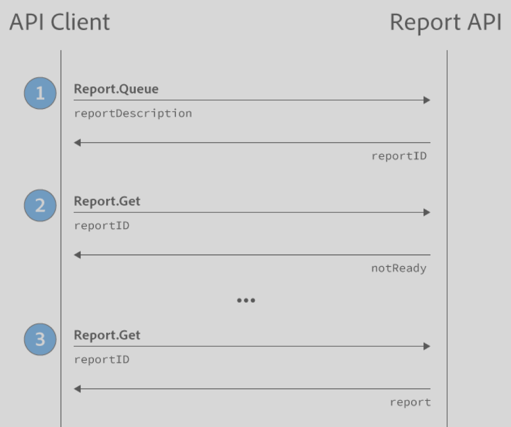

# 1.4 Reporting API

The Adobe Analytics 1.4 API provides a way for you to obtain reports without using Reports & Analytics or Analysis Workspace. It allows you to submit a request for a report, then you can submit a request to retrieve the report once it is done processing. 

<InlineAlert variant="note" slots="text"/>

Adobe recommends using the [Adobe Analytics 2.0 Reporting API](https://developer.adobe.com/analytics-apis/docs/2.0/guides/endpoints/reports/) to retrieve reports.

The overarching workflow to retrieve a report is as follows:



1.  Open the API Explorer in Developer Connection.
2.  Use the method `Report.Queue` with a JSON body that includes the desired report. The Reporting API returns a report ID.
3.  Change the method to `Report.Get` using the report ID. If the report is ready, you receive a JSON object with the report. Otherwise, the API responds that the report is not yet ready.

## Examples

In the following examples, replace "rsid" with your report suite id, and update the URL to use the correct endpoint.

```json
//Simplest Request
https://api.omniture.com/admin/1.4/rest/?method=Report.Queue
{
    "reportDescription":{
        "reportSuiteID":"rsid"
    }
}

//overtime report
https://api.omniture.com/admin/1.4/rest/?method=Report.Queue
{
    "reportDescription":{
        "reportSuiteID":"rsid",
        "dateGranularity":"hour"
    }
}

//Ranked Report
https://api.omniture.com/admin/1.4/rest/?method=Report.Queue
{
    "reportDescription":{
        "reportSuiteID":"rsid",
        "elements":[
            {"id":"page"}
        ]
    }
}

//Trended Report
https://api.omniture.com/admin/1.4/rest/?method=Report.Queue
{
    "reportDescription":{
        "reportSuiteID":"rsid",
        "dateGranularity":"hour",
        "elements":[
            {"id":"page"}
        ]
    }
}

//Pathing Report -- NextPage Flow
https://api.omniture.com/admin/1.4/rest/?method=Report.Queue
{
    "reportDescription":{
        "reportSuiteID":"rsid",
        "metrics":[
            {"id":"pageviews"}
        ],
        "elements":[
            {"id":"page",
            "top":"10",
            "startingWith":"1",
            "pattern":[
                ["homepage"],
                ["::anything::"],
                ["::anything::"],
                ["::anything::"],
                ["::anything::"]
            ]}
        ]
    }
}

//Pathing Report -- PreviousPage Flow
https://api.omniture.com/admin/1.4/rest/?method=Report.Queue
{
    "reportDescription":{
        "reportSuiteID":"rsid",
        "metrics":[
            {"id":"pageviews"}
        ],
        "elements":[
            {"id":"page",
            "pattern":[
                ["::anything::"],
                ["::anything::"],
                ["::anything::"],
                ["::anything::"],
                ["homepage"],
            ]}
        ]
    }
}
            
//Pathing Report -- Fallout
https://api.omniture.com/admin/1.4/rest/?method=Report.Queue
{
    "reportDescription":{
        "reportSuiteID":"rsid",
        "metrics":[
            {"id":"pageviews"}
        ],
        "elements":[
            {"id":"page",
            "checkpoints":[
                "homepage",
                "/templates/choose-your-powerpoint-fonts-wisely/"
            ]}
        ]
    }
}
 
// Real-Time Report
// Note the inclusion of "source" equals "realtime"
// Make sure you configure Real-Time reports for the report suite
https://api.omniture.com/admin/1.4/rest/?method=Report.Run
{
    "reportDescription": {
        "source": "realtime",
        "reportSuiteID": "rsid",
        "metrics": [
            { "id": "revenue" }
        ]
    }
}

// Real-Time Report with sort options
https://api.omniture.com/admin/1.4/rest/?method=Report.Run
{
    "reportDescription": {
        "source": "realtime",
        "reportSuiteID": "rsid",
        "sortMethod": "mostPopular:.25:0:linear",
        "metrics": [
            { "id": "pageviews" }
        ]
    }
}

// Summary Report
// Note that the "reportSuiteID" parameter is not included
// and the elements list contains "reportsuite"
// Report suites are provided in the "selected" element
https://api.omniture.com/admin/1.4/rest/?method=Report.Queue
{
    "reportDescription":{
        "date":"YYYY",
        "metrics":[
            {
                "id":"pageviews",
            },
            {
                "id":"revenue",
            },
        ],
        "elements":[
            {
                "id":"reportsuite",
                "selected":[
                    "rsid1",
                    "rsid2"
                ]
            }

        ],
    }
}

//Error Message 
https://api.omniture.com/admin/1.4/rest/?method=Report.Queue
{
    "reportDescription":{
        "reportSuiteID":"rsid",
        "dateGranularity":"hours"
    }
}

//Validate Report Definiton (without Queuing it)
https://api.omniture.com/admin/1.4/rest/?method=Report.Validate
{
    "reportDescription":{
        "reportSuiteID":"rsid",
        "dateGranularity":"hours"
    }
}

//GetMetrics
https://api.omniture.com/admin/1.4/rest/?method=Report.GetMetrics
{
    "reportSuiteID":"rsid",
    "existingElements":["page"]
}

//GetElements
https://api.omniture.com/admin/1.4/rest/?method=Report.GetMetrics
{
    "reportSuiteID":"rsid",
    "existingMetrics":["pageviews"]
}
```

